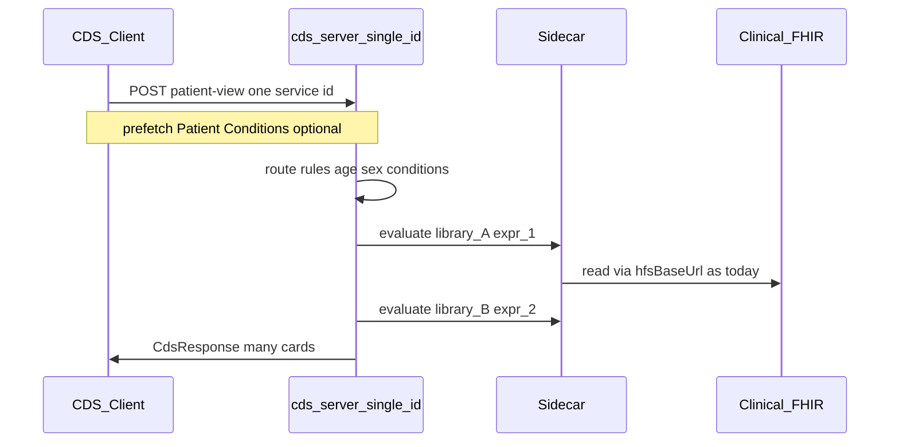
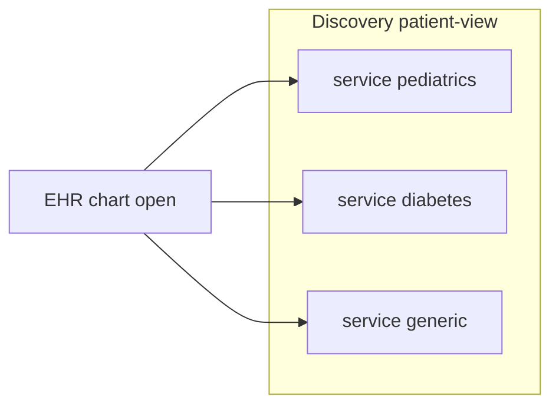

> **Note:** The canonical CDS + KR plan lives in **[cds_hooks_knowledge_repository.plan.md](cds_hooks_knowledge_repository.plan.md)**. The sections below remain as extended discussion (orchestration options, prefetch).

---

# Multi-service IDs vs single ID + routing (chart-open CDS)

## How CDS Hooks usually behaves

On **`patient-view`**, the CDS Client loads discovery, keeps entries whose **`hook`** is `patient-view`, then typically invokes **each** subscribed service (often **one HTTP POST per service id**). Each POST returns a **`CdsResponse`** that may contain **multiple cards**, but one service is still one logical integration surface.

So:

- **Many service ids** ⇒ many POSTs from the EHR (parallel or sequential), each producing cards.
- **One service id** ⇒ one POST per chart open (for that subscription); that server may still return **many cards** after running **many internal evaluations**.

Both are valid in production; the split is **who orchestrates** conditional work: the **EHR** (by which services it subscribes to and calls) vs your **CDS server** (inside one handler).

---

## Your scenario (sex, age, active conditions → multiple evaluations)

You want **one user action** (open chart) to drive **several possible CQL/Library evaluations** depending on **patient facts**.

### Option 1 — Single service id + internal routing (often best fit here)

**Flow:** EHR calls `POST /cds-services/{one-id}` once. Your server:

1. Parses **`context`** (`patientId`, etc.).
2. Uses **`prefetch`** (preferred) and/or **authorized FHIR reads** to obtain **`Patient`**, **`Condition`** (active problem list), etc.
3. Runs a **rules layer** (if age &gt; X and Condition.code in … → enqueue evaluation A; if sex is … → enqueue B).
4. Calls the JVM sidecar **multiple times** (different library/expression pairs as needed).
5. Merges results into **one `cards` array** (and optionally sets indicators, links).

**Pros:** One subscription per “chart CDS”; branching stays in one codebase; matches mental model “chart opened → run our rules engine.”

**Cons:** Larger prefetch or server-side read surface; all logic in one deployable; need good logging when one sub-eval fails.

### Option 2 — Multiple service ids (each a narrow rule family)

**Flow:** Discovery lists **many** `patient-view` services, e.g. `pediatric-rules`, `diabetes-rules`, `oncology-rules`. The EHR invokes **each** id it has subscribed to.

Each handler can stay **simple** (often one library/expression or a small fixed set).

**Pros:** Strong **separation** (teams ship separate services); partial rollout (enable/disable subscriptions in EHR); failure isolation per POST.

**Cons:** **Orchestration splits**: which rules run is partly an **EHR configuration** problem; **N round-trips**; risk of inconsistent prefetch across services unless templates align.

**When it shines:** Different vendors, different SLAs, different prefetch needs, or EHR already manages “which CDS modules are on.”

### Option 3 — Hybrid (common at scale)

- **Single “orchestrator” service id** for most conditional evaluations (returns many cards).
- **Separate ids** only for heavy or third-party modules that need isolation or different contracts.

---

## Data dependency note (conditions / demographics)

Rules need **`Patient`** (birthDate, gender, …) and **`Condition`** (or Encounter context). Today [`cds-server`](crates/cds-server/src/services/mod.rs) passes **`patient_id`** into the sidecar; **richer inputs** usually come from:

1. **`prefetch`** on the CDS service definition (EHR runs `Condition?patient=…` and attaches JSON under a prefetch key), or  
2. **`fhirAuthorization`** so **your CDS server** can call clinical FHIR before/instead of relying only on sidecar reads (not implemented yet in `cds-server`).

Without one of those, **sex/age/conditions-driven branching inside Rust** cannot work reliably.

---

## Prefetch vs server-side FHIR reads (FHIR / CDS Hooks wording)

The spec is describing **two ways the EHR can supply data**, not a mandate that CDS vendors implement **both** mechanisms in every deployment.

- **Hook context** — Information that is **intrinsic to the hook** (e.g. `patient-view` supplies `patientId`, `userId`, …). The EHR includes this in **`CdsRequest.context`**.

- **Prefetch templates** — Extra **FHIR REST queries** the CDS Service declares in discovery (`prefetch` map). They are **parameterized by context** (e.g. `Patient/{{context.patientId}}`). The EHR **may** execute those queries and attach results under **`CdsRequest.prefetch`**. The stated goal is to **relieve the CDS Service from having to fetch that data itself** when the client cooperates.

So:

- **You do not *have* to support both paths** to be “spec compliant” at a high level: you need a **clear strategy** for getting required FHIR inputs (Patient, Conditions, …).
- **Prefetch-only** is valid if every integrating EHR reliably honors your prefetch keys (or you accept degraded behavior when prefetch values are `null` / absent).
- **Server-side reads** (typically using **`fhirServer`** + **`fhirAuthorization`** on the hook request) are the fallback when prefetch is missing, incomplete, too large, needs freshness beyond what the client bundled, or when integrating clients do not implement prefetch well.

**Common production pattern:** Implement **prefetch consumption first** (parse `request.prefetch`, validate shapes), then add **optional authorized FHIR GET** when token + base URL are present or when required keys are missing—same CDS Service, two input channels.

**Sidecar note:** Today evaluation often still pulls clinical/KR data via **`hfsBaseUrl`** / **`libraryBaseUrl`** inside the JVM path; routing rules **inside `cds-server`** that depend on Condition codes still need those resources in **this** process (prefetch JSON) or via **direct FHIR calls** from Rust—not assumed today.

---

## Recommendation tied to your question

For **chart-open with many patient-dependent evaluations**, **single service id + internal routing + multiple sidecar calls** is usually the clearest model: one POST, one place that encodes “if male & age &gt; 50 & diabetes then evaluate X.”

Use **multiple service ids** when product/org boundaries or EHR subscription models require **separate endpoints** or **separate vendors**, not because branching exists—branching exists in both patterns.

---

## Links to current code

- Catalog + KR Binary: [`crates/cds-server/src/kr_manifest.rs`](../../crates/cds-server/src/kr_manifest.rs), [`crates/cds-server/src/main.rs`](../../crates/cds-server/src/main.rs)
- Invoke + registry: [`crates/cds-server/src/services/mod.rs`](../../crates/cds-server/src/services/mod.rs)
- Full picture: **[cds_hooks_knowledge_repository.plan.md](cds_hooks_knowledge_repository.plan.md)**
