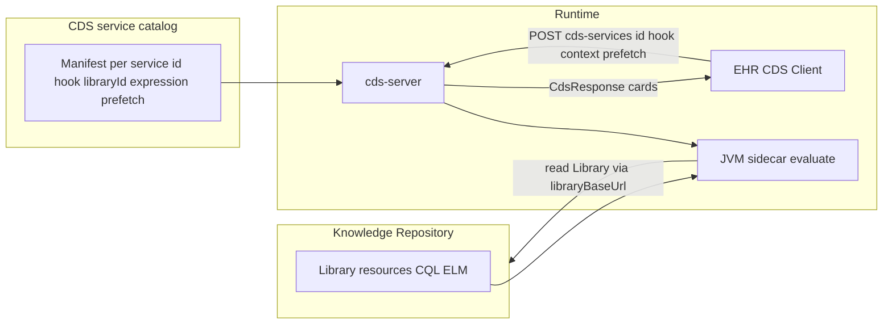

# CDS Hooks + Knowledge Repository (workspace plan)

This document captures the agreed **mental model** and **design choices** for clinical decision support using CDS Hooks, an FHIR Knowledge Repository (KR), CQL Libraries, and [`cds-server`](crates/cds-server/).

---

## Standard CDS Hooks (interoperability)

For real EHR integrations, use **hook names and context shapes** from the [CDS Hooks library](https://cds-hooks.hl7.org/) (examples: `patient-view`, `order-sign`, `order-select`, `medication-prescribe`, `encounter-start`, …). Maturity levels indicate how finalized / widely supported a hook is; lower maturity hooks are still standard hooks but may have spottier client support.

Custom/vendor hooks are possible but break interoperability unless the client explicitly supports them.

---

## Mental model (KR → binding → CDS → cards)

1. **KR** holds **computable knowledge**: chiefly FHIR **`Library`** resources (CQL/ELM). A library may expose **multiple named expressions**; teams often still structure **one main logic module per library** for clarity.

2. **CDS Hooks** defines **when** the EHR calls you (**hook**) and **what context** is included. It does **not** automatically map hooks to CQL — that mapping is **your responsibility**.

3. **Service catalog (manifest)** binds each **`cds-services/{id}`** to:
   - **`hook`** (e.g. `patient-view`)
   - **`libraryId`** + **`expression`** (what the JVM evaluates)
   - optional **`prefetch`** templates, titles, descriptions (discovery)

4. **`cds-server`** loads the catalog from a **JSON file** ([`CDS_SERVICES_MANIFEST_PATH`](crates/cds-server/README.md)) and/or a KR **`Binary`** ([`CDS_KR_SERVICES_BINARY_ID`](crates/cds-server/src/kr_manifest.rs)), registers **many service ids**, and on invoke calls the sidecar / returns demo cards.

5. **Cards** (and optionally **suggestions/actions**) are produced by **`cds-server`** after evaluation (and any mapping from structured results to CDS Hooks types).

---

## Catalog delivery: JSON file vs KR `Binary`

| Source | Behavior |
|--------|----------|
| **Local/path JSON** | No KR HTTP at startup for catalog; KR used when **evaluate** resolves `Library` via sidecar (`libraryBaseUrl`, `libraryId`). Simplest ops / GitOps. |
| **FHIR `Binary` on KR** | `GET Binary/{id}` at startup; catalog editable as FHIR content; startup depends on KR availability for discovery reload. |

Neither is universally “better”: **file** for deploy simplicity; **`Binary`** for KR-governed, runtime-updated catalogs without redeploying `cds-server`.

---

## Multi-service ids vs one service + internal routing

- **Many CDS service ids**: EHR typically issues **one POST per subscribed** service on the same hook. Good for isolation, teams, subscriptions.
- **One service id + routing**: One POST; server runs **multiple** evaluations and returns **many cards**. Good when branching on patient/prefetch should live in one place.

Branching does **not** require multi-id design; **hybrid** is common at scale.

Details and diagrams: historical notes remain useful in [.cursor/plans/cds_eval_orchestration_multi_vs_single.plan.md](cds_eval_orchestration_multi_vs_single.plan.md) (or fold into this doc only).

---

## Prefetch vs CDS server FHIR reads

- **Context**: required hook payload from the EHR.
- **Prefetch**: optional FHIR queries in discovery; EHR **may** attach results — reduces need for CDS-initiated reads when clients cooperate.
- **Server-side reads**: use **`fhirServer`** + **`fhirAuthorization`** when prefetch is missing or insufficient.

Implement **prefetch consumption first** in [`cds-server`](crates/cds-server/src/services/mod.rs); add authorized reads as a second channel when needed.

---

## Current implementation snapshot ([`cds-server`](crates/cds-server/))

- **Manifest**: JSON schema in [`kr_manifest.rs`](crates/cds-server/src/kr_manifest.rs); **`patient-view` only** validated for invoke (other hooks rejected at manifest parse until implemented).
- **Services**: [`SidecarEvalService`](crates/cds-server/src/services/mod.rs) + [`registry_from_manifest`](crates/cds-server/src/services/mod.rs).
- **Bootstrap**: [`main.rs`](crates/cds-server/src/main.rs) — catalog from **`CDS_SERVICES_MANIFEST_PATH`** or KR **`Binary`** (`CDS_KR_SERVICES_BINARY_ID` + `CDS_LIBRARY_BASE_URL`); fallback demo manifest when neither is set; sidecar URL requires one of the catalog sources.
- **Example**: [`cds-services.manifest.example.json`](crates/cds-server/cds-services.manifest.example.json).

---

## References (repo)

- CDS protocol types: [`helios-cds-hooks`](crates/cds-hooks/)
- Sidecar client: [`atrius-clinical-reasoning`](crates/atrius-clinical-reasoning/)
- CR / KR alignment context: [.cursor/plans/cr_spec_crate_alignment.plan.md](cr_spec_crate_alignment.plan.md)
