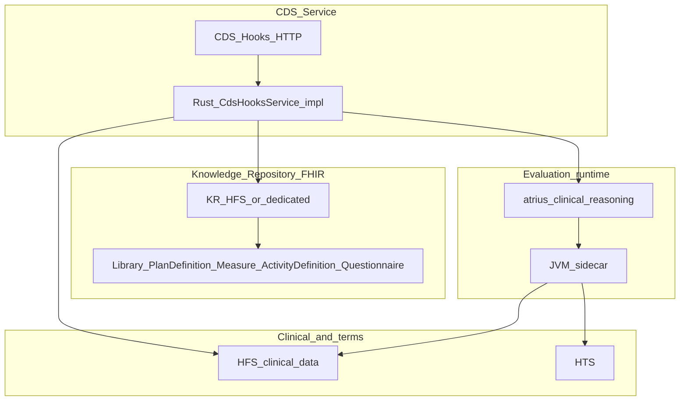
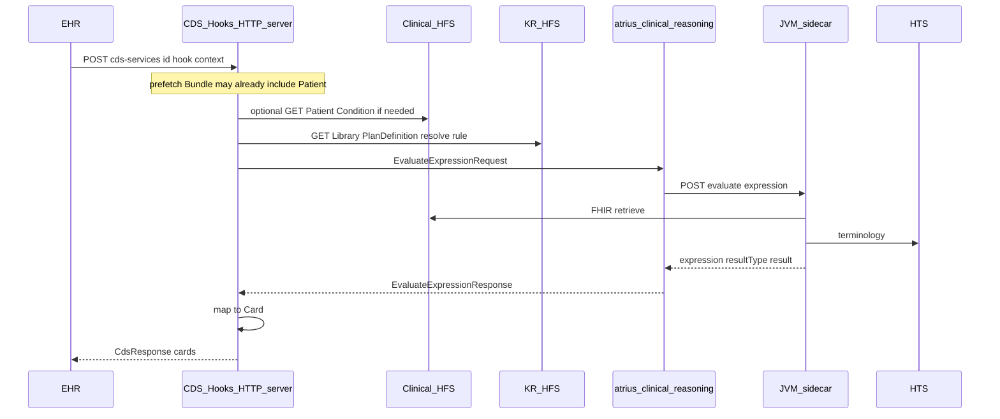

# Clinical Reasoning alignment — Knowledge Repository + CDS Service

## Answer: yes, move toward both pillars

That split matches the FHIR Clinical Reasoning module’s two primary use cases:

1. **Sharing** → a **Knowledge Repository** implemented as a **FHIR server** with standard **search** and **read** (and create/update for publishers), hosting **`Library`**, **`PlanDefinition`**, **`Measure`**, **`ActivityDefinition`**, and related definitional resources used to represent rules, order sets, protocols, templates, and measures.
2. **Evaluation** → a **CDS Service** that uses **CDS Hooks** so an EHR can request **remote clinical decision support** and receive **cards / suggestions**—your runtime pulls knowledge from the KR (or prefetch), evaluates via **JVM sidecar** (`atrius-clinical-reasoning`), and returns CDS Hooks responses.

Advanced knowledge management (**change management**, **semantic indexing**, **dependency tracking**) is **additive**: it sits **on top of** baseline FHIR REST + metadata (`relatedArtifact`, canonical URLs, versioning)—not a replacement for a standards-based KR.

See also: [fhir_clinical_reasoning.plan.md](fhir_clinical_reasoning.plan.md), [library_knowledge_artifacts.plan.md](library_knowledge_artifacts.plan.md), [atrius_clinical_reasoning_sidecar_client.plan.md](atrius_clinical_reasoning_sidecar_client.plan.md).

---

## Architecture (locked direction)

- **KR** and **clinical HFS** may be one deployment or two bases URLs (already discussed in library KR plan); CDS service must know **`libraryBaseUrl`** vs **`hfsBaseUrl`** when they diverge.
- **`atrius-clinical-reasoning`** remains the **HTTP façade to the sidecar**, not the KR server itself.

---

## Artifact modeling (informative mapping)

FHIR uses definitional resources + profiles; labels below are **product-facing** mappings—exact profiles come from CR IG:

| Concept | Typical FHIR representation |
|---------|----------------------------|
| **ECA rule** | **`PlanDefinition`** (workflow/actions) + **`Library`** (CQL/ELM); expressions referenced from definitional elements |
| **Order set** | **`PlanDefinition`** / **`ActivityDefinition`** (orderables, nested actions) |
| **Protocol** | **`PlanDefinition`** (strategy/pathway) |
| **Documentation template** | Often **`Questionnaire`** (SDC) and/or **`Composition`**—confirm against IG slice used |
| **Quality measure** | **`Measure`** + referenced **`Library`** |

Conformance: adopt **Shareable***, **CQLLibrary**, **ComputablePlanDefinition**, **CDSHooksPlanDefinition**, etc., via **`meta.profile`** + [`helios-fhir-validation`](crates/fhir-validation)—incrementally.

---

## Phase sequencing

### Phase 1 — Knowledge Repository (baseline)

- FHIR **CRUD + search + read** for artifact types you ship first (`Library`, `PlanDefinition`, `Measure`, …).
- **`CapabilityStatement`** advertising KR-style interactions.
- Default **shared** tenancy for knowledge resources unless product requires tenant-private libraries ([`DefaultResourceTenancy`](crates/persistence/src/tenant/tenancy.rs) / overrides).

### Phase 2 — CDS Service (CDS Hooks)

- Implement **`CdsHooksService`** using [`helios-cds-hooks`](crates/cds-hooks): discovery, hook handlers.
- For each hook: resolve context → optional **read from KR** / prefetch from clinical HFS → **`EvaluateExpressionRequestBuilder`** + **`ClinicalReasoningClient`** → normalize **`result`** → **`Card`** mapping conventions.

### Phase 3 — Advanced KM (optional, parallel)

- **Change management**: immutable versions, publication workflow, audit.
- **Dependency tracking**: graph over **`relatedArtifact`**, `depends-on`, Library includes.
- **Semantic indexing**: external search (OpenSearch/ES) or FTS keyed by canonical URL—does not change FHIR logical model.

### Phase 4 — Broader CR operations

- **`Measure/$evaluate-measure`**, **`PlanDefinition/$apply`**, FHIR-native CDS artifacts (**GuidanceResponse** bridge)—extend sidecar + façades per [fhir_clinical_reasoning.plan.md](fhir_clinical_reasoning.plan.md).

---

## Dedicated Knowledge Repository leveraging HFS

A **dedicated KR** here means a **separate HFS deployment** (same [`helios-hfs`](crates/hfs) binary and [`helios-rest`](crates/rest) FHIR API), not a different FHIR engine. You **leverage HFS** by running another process with KR-specific config, URL, and datastore.

### Deploy separately

1. **Own process** — second `hfs` instance (or separate cluster service) with distinct **`HFS_SERVER_HOST` / `HFS_SERVER_PORT`**, **`HFS_BASE_URL`** (for generated links), and **`DATABASE_URL`** / **`HFS_STORAGE_BACKEND`** so artifact storage is isolated from PHI-heavy clinical traffic.
2. **Own base URL** — e.g. `https://kr.example.org` vs `https://fhir.example.org`; callers use this as **`libraryBaseUrl`** in [`EvaluateExpressionRequest`](crates/atrius-clinical-reasoning/src/dto.rs) while **`hfsBaseUrl`** stays the clinical server.
3. **CapabilityStatement** — describe this endpoint as the knowledge / artifact server (supported types, search params).

### Persistence — not “deploy only”

The KR **persists** artifacts the same way any HFS instance does: **write-through to its configured storage backend**. “Dedicated deploy” implies **dedicated durable storage**:

- **SQLite file** or **PostgreSQL** URL for `DATABASE_URL` / backend-specific vars (see [HFS README](crates/hfs/README.md) and `HFS_STORAGE_BACKEND`).
- **Elasticsearch** (or similar) when using composite modes for search-backed catalogs — indexes are part of that deployment’s persistence story.
- **Backups, replication, retention** are ops concerns on **that** database (and ES indices), independent of the clinical HFS database.

There is **no second persistence layer** required for KR semantics: the **FHIR resources are the source of truth** in the KR HFS store.

### Optional separate Rust crate — client/orchestrator, not where data lives

You **do not** need a new crate “for KR to persist.” Persistence lives **inside the KR `hfs` process** via [`helios-persistence`](crates/persistence).

A **separate crate** is optional for **callers** that publish or consume the KR over HTTP:

- Thin **`reqwest`** + `serde_json` / **`helios-fhir`** types for `POST Library`, `GET Library?url=…`, bundle uploads, etc.
- CI pipelines, CDS services, or admin CLIs that **orchestrate** publishing (validate ELM, attach `Library.content`, transaction Bundles).

That crate would hold **KR base URL**, auth headers, and workflow helpers — analogous to [`atrius-clinical-reasoning`](crates/atrius-clinical-reasoning) calling the **sidecar**, not replacing **HFS storage**. You might introduce something like `atrius-kr-client` or a KR submodule under a CDS orchestration crate for ergonomics only. Making the server “KR-suited” is primarily **deployment configuration** (`DATABASE_URL`, profiles manifest, tenancy), not a different persistence crate.

### KR-oriented HFS profile (auth / tenancy)

Many KR deployments want **no JWT auth** and **no meaningful tenant isolation**: artifacts are **globally readable** within the trust boundary (network / gateway). HFS already supports that shape:

- **Auth off** — [`AuthConfig::from_env`](crates/auth/src/config.rs): **`HFS_AUTH_ENABLED`** unset or `false` disables inbound JWT middleware (default).
- **Knowledge resources shared** — [`DefaultResourceTenancy`](crates/persistence/src/tenant/tenancy.rs) treats `Library`, `Measure`, `PlanDefinition`, etc. as **`TenancyModel::Shared`**, so isolation matches “no tenant walls” for those types.
- **Operational simplicity** — use **`HFS_DEFAULT_TENANT=default`** (or single org id) and **`HFS_TENANT_ROUTING_MODE=header_only`** so internal callers do not need URL-prefix tenants unless you standardize one pattern.

Production KR behind a **corp VPC or API gateway** may still add **mTLS or API keys at the edge**; that is orthogonal to enabling full HFS JWT auth inside.

### Packaging: “run KR HFS” without a new binary

You **reuse the same `hfs` binary**. A **configuration bundle**—not a separate persistence crate—documents defaults:

| Artifact | Role |
|----------|------|
| **`.env.kr.example`** (repo root or `deploy/kr/`) | Documents KR env: `HFS_AUTH_ENABLED=false`, dedicated `DATABASE_URL`, optional `HFS_PROFILE_MANIFEST`, `HFS_BASE_URL`, port, storage backend. |
| **`docker-compose.kr.yml`** or **Kubernetes manifest** | Runs `hfs` with that env file mounted; volume for SQLite or connection string for Postgres. |
| **`scripts/run-kr-hfs.sh`** or **`just kr`** | `set -a; source .env.kr; set +a; exec cargo run -p helios-hfs --release` (or invoke binary). |

Optional later: a **`BINARY`** / **`Dockerfile`** stage labeled `hfs-kr` that only differs by **CMD** and **env file**—still the same build artifact.

No **second Cargo crate** is required for “KR mode”; add one only if you want typed **publish CLI** clients calling this server.

### Use standard HFS capabilities

- **CRUD + search + read** for `Library`, `PlanDefinition`, `Measure`, `ActivityDefinition`, `Questionnaire`, etc. via existing type routes.
- **Tenancy** — [`DefaultResourceTenancy`](crates/persistence/src/tenant/tenancy.rs) marks knowledge resources **shared** by default; use **`CustomResourceTenancy`** if a KR deployment must be tenant-scoped.
- **Conformance** — **`HFS_PROFILE_MANIFEST`** at startup ([`crates/hfs/src/main.rs`](crates/hfs/src/main.rs)) to load Shareable*/CQLLibrary (and related) StructureDefinitions into validation context when REST validation is wired for writes.
- **Search scale** — composite backends (**Postgres + Elasticsearch**, etc.) per [HFS README](crates/hfs/README.md) if the KR catalog needs heavier search than SQLite-only.

### Gaps to handle outside or above core HFS

- **KR-only resource policy** (reject `Patient`, etc.) — typically an **API gateway**, reverse proxy rules, or future server config; HFS does not ship a built-in “definitional-only” mode today.
- **Packaging operations** (e.g. IG **`$package`-style** flows) — automate with **Bundles**, CI publish jobs, or dedicated tooling until optional operations exist.

### Advanced KM on this footprint

- **Dependency tracking** — scan `relatedArtifact`, canonical references, Library includes (batch or incremental jobs against KR Export/search).
- **Change management** — leverage resource versioning, immutability conventions, and HFS **audit** patterns where enabled.
- **Semantic indexing** — ES-backed search plus optional external NLP/tag pipelines keyed by resource identity.

---

## CDS Hooks service: hook → KR + evaluator → Card (workspace crates)

Your mental model is right for hooks like **`patient-view`** (chart opened): the **CDS Service** receives the hook POST, optionally ensures **clinical data** is available (prefetch from EHR payload or explicit GETs against **clinical HFS**), pulls **knowledge** from the **KR HFS** when logic is artifact-driven, calls the **evaluator** (JVM sidecar via Rust façade), then returns **`Card`**s in a CDS Hooks **`CdsResponse`**.

### Crate responsibilities

| Crate | Role in CDS path |
|-------|------------------|
| **[`helios-cds-hooks`](crates/cds-hooks)** | **Protocol**: [`CdsHooksService`](crates/cds-hooks/src/service.rs) trait, hook **context** types ([`hooks.rs`](crates/cds-hooks/src/hooks.rs)), [`Card`](crates/cds-hooks/src/models.rs) / [`CdsResponse`](crates/cds-hooks/src/models.rs), [`CdsHooksError`](crates/cds-hooks/src/service.rs). **Does not** embed HTTP server or CQL—you implement `call()` in your binary/crate. |
| **[`atrius-clinical-reasoning`](crates/atrius-clinical-reasoning)** | **Evaluator façade**: [`ClinicalReasoningClient`](crates/atrius-clinical-reasoning/src/client/http.rs) → JVM sidecar; [`EvaluateExpressionRequestBuilder`](crates/atrius-clinical-reasoning/src/request_builder.rs) with **`libraryBaseUrl` = KR**, **`hfsBaseUrl` = clinical**, **`htsBaseUrl` = HTS**; [`normalized_result`](crates/atrius-clinical-reasoning/src/normalized_result.rs) for mapping engine output to cards. |
| **`helios-hfs` (deploy twice)** | **Clinical** instance: Patient, Condition, … **KR** instance: Library, PlanDefinition, … CDS handler uses **two base URLs** (or prefetch-only for clinical if EHR sends everything). |
| **`helios-fhir` / `helios-rest`** | Parsing or serializing FHIR from prefetch; if CDS HTTP server lives inside Rust, you may reuse REST client patterns or plain **`reqwest`** + JSON. No dedicated “CDS binary” exists in workspace yet—pattern mirrors **`sof-server`** / **`fhirpath-server`** as a small Axum binary that **depends on** `helios-cds-hooks` + `atrius-clinical-reasoning`. |
| **JVM sidecar** (external repo) | **CQL/ELM execution**; not a Rust crate. |

### What you still implement (glue)

1. **HTTP routes** for `GET /cds-services`, `POST /cds-services/{id}`, feedback—wire to your `CdsHooksService` impl (Axum/Actix/etc.).
2. **Rule selection** — how hook + service id maps to **`libraryId` / expression / PlanDefinition`** (config, `GuidanceResponse`-style metadata, or KR search).
3. **FHIR HTTP clients** — minimal **`reqwest`** calls to **clinical HFS** and **KR HFS** (or inject shared client); tenant headers on **clinical** requests if required.
4. **Card mapping** — translate [`NormalizedSidecarResult`](crates/atrius-clinical-reasoning/src/normalized_result.rs) / raw JSON into [`Card`](crates/cds-hooks/src/models.rs) variants (info, warning, suggestion links).

That glue can live in **`helios-hfs`** behind optional routes, or a **`cds-server`** crate under `crates/` for separation—product choice; the **workspace crates already split** protocol (`cds-hooks`), evaluation HTTP (`atrius-clinical-reasoning`), and FHIR storage (`hfs`).

---

## Relation to “comprehensive CR spec” plan

This document **narrows implementation priority**: **KR FHIR server first**, **CDS Hooks service second**, sidecar façade already in motion. The earlier matrix-style alignment (profiles, Measure Processor wording) still applies but **delivery order** favors **sharing infrastructure + CDS entrypoint** before exotic FHIR–CDS serialization bridges.

---

## Success criteria

1. Publishers and consumers can **find and read** versioned knowledge artifacts via **standard FHIR**.
2. An EHR can call your **CDS Hooks** endpoints and receive **decision support** backed by **KR + sidecar** evaluation.
3. Clinical data and terminology URLs remain **explicit per tenant** in evaluation requests.
