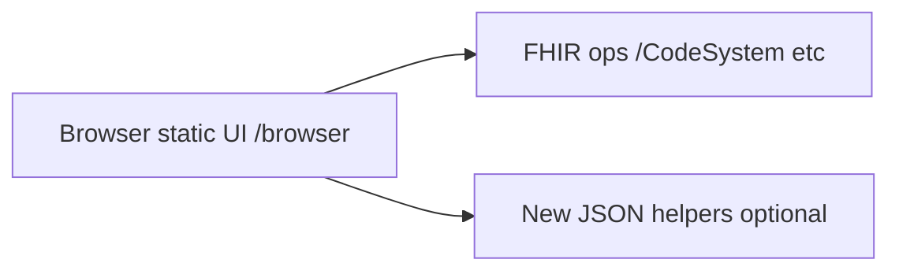

# HTS terminology browser (Snowstorm-inspired)

## Context

- HTS today is **API-only** ([`crates/hts/src/server.rs`](crates/hts/src/server.rs)): FHIR terminology routes, **no static UI**, no concept text-search operation.
- **[Snowstorm browser](https://github.com/IHTSDO/snowstorm)** is a **SNOMED-first** product: rich concept search, stated/inferred views, refsets, etc., backed by Elasticsearch and SNOMED-specific REST—not the same contract as HTS.
- HTS **does** have data you can build a useful browser on: [`concept_hierarchy`](crates/hts/src/backends/sqlite/schema.rs) (parent/child links), [`concepts`](crates/hts/src/backends/sqlite/schema.rs) (code, display), designations, and [`$lookup`](crates/hts/src/operations/lookup.rs) / [`$subsumes`](crates/hts/src/operations/subsumes.rs) / [`ValueSet/$expand`](crates/hts/src/operations/expand.rs) with `filter` and `hierarchical` (see expand implementation in [`crates/hts/src/backends/sqlite/value_set.rs`](crates/hts/src/backends/sqlite/value_set.rs)).

## Architectural choice

Serve a **small static web app** from the Axum router (nested under `/browser` to avoid conflicting with `POST /` batch on [`/`](crates/hts/src/server.rs)):

- Add `tower-http` **`fs`** feature and use **`ServeDir`** for `GET /browser/*` (or **`rust-embed`** + a single fallback route if you want a single-binary, no-filesystem-deploy story).
- UI is **same-origin** `fetch()` to existing JSON/XML FHIR endpoints; no OAuth in v1 if HTS stays local/dev (optional later).

## Feature phases (recommended)

### Phase 1 — “Useful browser” without schema changes

- **List code systems**: `GET /CodeSystem?_count=...` (already [search.rs](crates/hts/src/operations/search.rs)).
- **Concept detail**: `GET /CodeSystem/$lookup?system=...&code=...` (show display, version, `property` including parent(s) where stored, designations).
- **Compare / prove path**: `$subsumes` for two selected codes.
- **ValueSet expansion** (when the user has a suitable persisted ValueSet): `$expand` with `filter` (substring on code/display) and optional `hierarchical=true` for a tree—**only viable for small expansions** given [`HTS_MAX_EXPANSION_SIZE`](crates/hts/src/config.rs) (default 3500) and memory.

**Limitation (important for SNOMED):** You cannot safely “expand everything then filter” for large editions; Phase 1 alone is **not** Snowstorm-class search for full SNOMED.

### Phase 2 — Hierarchy + search that Snowstorm users expect (small HTS extensions)

Add **narrow, documented JSON endpoints** (e.g. under `/browser/api/...` or `/fhir-proxy/...`) implemented on [`TerminologyBackend`](crates/hts/src/traits/mod.rs) for both SQLite and Postgres:

1. **`GET /browser/api/children`** — `system` (canonical URL) + `parentCode` → list direct children from `concept_hierarchy` (indexed by `idx_hierarchy_child` on SQLite). This is the missing primitive for “drill down” that `$subsumes` does not provide (pairwise only).
2. **`GET /browser/api/search`** — case-insensitive substring (and later FTS) over `concepts.display` and optionally `concept_designations.value`, scoped by `system`, with `_count` / `_offset`. This avoids abusing `$expand` and respects SNOMED scale.

Optional: **`GET /redirect` → `/browser/**`** for convenience since only `POST /` exists today.

### Phase 3 — Deeper Snowstorm parity (optional / large)

- **ECL playground**: HTS already evaluates ECL via ValueSet compose ([`ecl` module](crates/hts/src/ecl/mod.rs)), but `$expand` today requires a persisted ValueSet `url` ([`process_expand`](crates/hts/src/operations/expand.rs)). True “ad-hoc ECL” in the UI means either **importing scratch ValueSets** (poor UX) or extending `$expand` to accept an inline ValueSet/`valueSetVersion` workflow—spec-aligned but more engineering.
- SNOMED-only views (inactive concepts, axioms, MRCM, historical associations, refsets) would require **new storage and APIs** beyond current HTS scope.

## Non-goals (for a first delivery)

- Reusing Snowstorm’s frontend verbatim (different API shapes).
- Full-text search architecture identical to Snowstorm/Elasticsearch unless you deliberately add FTS/another index.

## Documentation and compliance

- Add a short **“Browser”** section to [`CLAUDE.md`](CLAUDE.md) (or HTS README if preferred): URL path, dependence on Phase 2 for large terminologies, and a reminder that SNOMED display/use still follows **your license/terms** (UI should show a configurable notice string via env e.g. `HTS_BROWSER_DISCLAIMER` if you want parity with public SNOMED browsers).

## Testing

- **Integration test** hitting `GET /browser/` (or embedded asset route) returns 200 + `text/html`.
- **Handler tests** for `/browser/api/search` and `/children` against a tiny fixture code system (reuse patterns from [`crates/hts/tests/`](crates/hts/tests/)).

## Key files to touch

- [`crates/hts/src/server.rs`](crates/hts/src/server.rs) — mount static + new routes.
- [`crates/hts/Cargo.toml`](crates/hts/Cargo.toml) — `tower-http` `fs` (or embed crate).
- New module e.g. `crates/hts/src/operations/browser_api.rs` + trait methods or direct backend queries mirroring [`code_system.rs`](crates/hts/src/backends/sqlite/code_system.rs) patterns.
- Postgres mirrors in [`crates/hts/src/backends/postgres/`](crates/hts/src/backends/postgres/).
