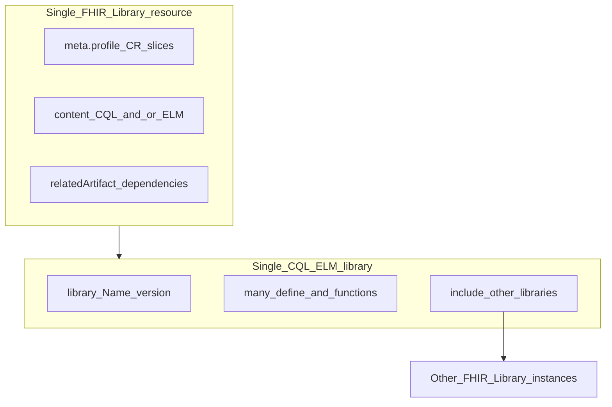

# Library / knowledge artifacts: profiles, CQL packaging, and implementation approach

## Conceptual answer: one Library vs many “logics”

**In CQL**

- A single **CQL document** has exactly one top-level **`library ... version '...'`** declaration (the library **name** and **version** CQ Framework matches to ELM `identifier`).
- That **same document** usually contains **many** reusable pieces: multiple **`define`** expressions, **`define function`**, **`context`**, **`include`** of other libraries, etc.

**In FHIR**

- **`Library`** is the **packaging / discovery** resource: canonical **`url`** + **`version`**, **`content`** attachments (CQL text, ELM JSON/XML, etc.), **`relatedArtifact`** for dependencies, **`parameter`**, **`dataRequirement`**, terminology hooks, etc.
- **One FHIR `Library` instance** typically corresponds to **one CQL library / one ELM Library artifact** (one identifier story). Measures, CDS, and `$evaluate-expression` then reference **specific expression names inside** that artifact (e.g. `"Numerator"`, `"InPopulation"`).

So: **not** “one expression = one FHIR Library” by default; **one FHIR Library wraps one logical CQL/ELM library**, which **contains many definitions**. Multiple FHIR Libraries appear when you **version**, **factor includes**, or **separate modules** (each with its own `library` declaration).

---

## Do you need all listed profiles “minimally”?

**No.** Those names are **profiles on the same base resource** [`Library`](crates/fhir/src/r4/resources/library.rs) (R4 in your stack). They **slice** `type`, `content`, metadata, and cardinality—they are not seven different storage shapes.

**Recommended MVP split**

| Profile | Role | MVP priority |
|---------|------|----------------|
| **LogicLibrary** | Baseline computable library: dependencies, parameters, data requirements, terminology hooks | **High** — aligns KR storage with CR expectations |
| **ELMLibrary** | Executable ELM in `content` with expected MIME types | **High** — matches JVM sidecar / `CqlEngine` input |
| **CQLLibrary** | Human-authored CQL in `content` | **Medium** — valuable if you store source and compile in CI or on ingest |
| **PublishableLibrary** | Extra metadata for publication/sharing (publisher, jurisdiction, effective period, …) | **Medium** — adopt when you care about repository-style sharing, not just internal storage |
| **FHIRPathLibrary** | FHIRPath logic in `content` | **Low** until you ship FHIRPath-first artifacts (you already have **`helios-fhirpath`** for evaluation elsewhere; this profile is about **packaging**, not capability) |
| **ModelInfoLibrary** | Model info for translators/engine | **Low** until you host custom model info packages |
| **ModuleDefinitionLibrary** | Module definitions (CQFM-style module defs) | **Low** until measure/reporting pipelines need that artifact type |

**Practical rule:** implement **one code path** — persist **`Library`** JSON/Rust model — and enforce profiles via **`meta.profile`** + optional **StructureDefinition** validation, rather than maintaining seven Rust structs.

---

## How this maps to Helios today

- **Data model:** Generated **`Library`** already exists under [`crates/fhir/src/r4/resources/library.rs`](crates/fhir/src/r4/resources/library.rs).
- **Conformance:** [`helios-fhir-validation`](crates/fhir-validation) can validate instances against extracted profiles (`ProfileRegistry`, `validate_resource_with_profiles`) once IG **`StructureDefinition`** JSON for those profiles is available at runtime.
- **Execution:** [`atrius-clinical-reasoning`](crates/atrius-clinical-reasoning) today accepts inline ELM; the KR step is **resolving `Library.content` → ELM string** + **`url`/`version`/`libraryId` alignment** before calling the sidecar.

---

## Suggested building steps (minimalistic but coherent)

1. **KR storage behavior (HFS or dedicated service)**  
   - CRUD + search for **`Library`** by **`url`**, **`version`**, **`status`**, **`name`** (whatever your search parameter set exposes today).  
   - Treat **`meta.profile`** as the declarative “this instance claims to be LogicLibrary + ELMLibrary + …”.

2. **Content conventions**  
   - Attach **ELM** (`application/elm+json` / `application/elm+xml` per IG) as the execution artifact.  
   - Optionally attach **CQL** (`text/cql`) alongside for authoring/traceability.  
   - Use **`relatedArtifact`** (`depends-on`) for included libraries; mirror **`includedLibraries`** in sidecar requests when resolving multi-library ELM.

3. **Profile rollout**  
   - **Phase A:** Document required **`meta.profile`** URLs for stored artifacts (LogicLibrary + ELMLibrary). Optionally **skip hard validation** initially (warn-only).  
   - **Phase B:** Bundle CR IG **StructureDefinition** snapshots for those profiles into [`helios-fhir-validation`](crates/fhir-validation) registry (or load from package) and validate **on create/update**.  
   - **Phase C:** Add **PublishableLibrary** when publishing workflows matter; add **CQLLibrary** when source is mandatory; defer **FHIRPathLibrary**, **ModelInfoLibrary**, **ModuleDefinitionLibrary** until a concrete feature needs them.

4. **Wire to execution**  
   - Resolver: **`Library` id or canonical** → read **`content`** → pick ELM part → pass **`libraryId`/`libraryVersion`** consistent with ELM identifier → **`EvaluateExpressionRequest`**.

---

## Summary

- **CQL:** one **`library`** declaration per artifact; **many** definitions inside; **includes** create **additional FHIR `Library` instances** as dependencies.  
- **Profiles:** specialize the **same** FHIR `Library` resource—prioritize **LogicLibrary + ELMLibrary** for Reasoning; add **PublishableLibrary** / **CQLLibrary** when metadata/source matter; treat the others as **later**.  
- **Implementation:** single **`Library`** persistence + **`meta.profile`** + validation pipeline—not parallel implementations of seven profile types.
