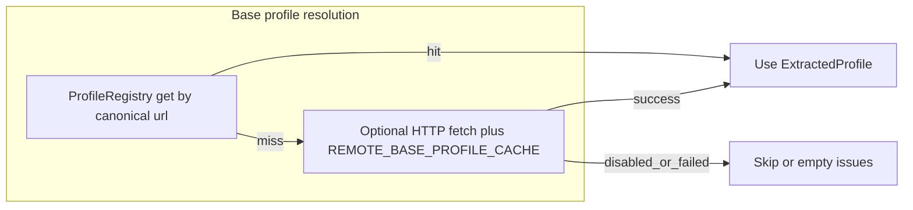

# Profile registry, baseDefinition lookups, and IG materialization

This document captures the **scaling plan** for vendor IGs (e.g. Atrius on NDHM) plus national and cross-IG dependencies (mCode, etc.): what runs in memory, when network I/O happens, and how to build a deterministic `ProfileRegistry`.

Related code:

- [`ProfileRegistry`](../src/profile/profile_registry.rs) — `HashMap<String, ExtractedProfile>` keyed by canonical `StructureDefinition.url`.
- [`ValidationConfig`](../src/core.rs) — `recurse_on_base_definition`, `enable_base_definition_url_lookup`, allowlist, timeouts.
- [`structure_definition_json_fetch_url`](../src/profile/base_definition_fetch_url.rs) — rewrites canonical `baseDefinition` URLs to static JSON where conventions are known (NDHM `…-Type.json`, HL7 `…/R4/{type}.profile.json`).

---

## Curated slice vs network

A **curated** set of extracted profiles does **not** require network calls if:

1. Every `StructureDefinition` URL your validation path may need is **pre-loaded** into the runtime `ProfileRegistry` (declared profiles, `baseDefinition` chain for non-core bases, `type.profile` targets you enforce), **or**
2. You accept that missing profiles produce configured issues / skipped recursion rather than implicit fetch.

**Network** is used when:

- `ValidationConfig.enable_base_definition_url_lookup` is **true** (see defaults below),
- A needed base profile is **not** in `ProfileRegistry`,
- Resolution falls through to HTTP fetch (with optional hostname allowlist and in-process cache in `validate.rs`).



---

## Production-oriented `ValidationConfig` (baseDefinition URL lookup)

Defaults are defined in [`ValidationConfig::default`](../src/core.rs). Fields that matter for **remote base profile fetch**:

| Field | Default | Production recommendation |
|--------|---------|-----------------------------|
| `recurse_on_base_definition` | `true` | Keep `true` if you rely on national IG bases; ensure bases are in registry or fetch is policy-approved. |
| `enable_base_definition_url_lookup` | **`true`** | Prefer **`false`** for strict local-only validation, **or** keep `true` with a **non-empty** `base_definition_url_lookup_allowed_hosts` (e.g. `nrces.in`, `hl7.org`) and tight `base_definition_url_lookup_timeout_ms` / `base_definition_url_lookup_max_bytes`. |
| `base_definition_url_lookup_allowed_hosts` | **empty** (= allow any host, backward compatible) | Set to explicit hosts for defense in depth when lookup stays enabled. |
| `base_definition_url_lookup_timeout_ms` | `2000` | Lower for fail-fast; raise only if CDN latency requires it. |
| `base_definition_url_lookup_max_bytes` | `1_000_000` | Adjust to cap oversized responses. |

**NDHM / HL7 static JSON:** When lookup is enabled, the HTTP client uses the same User-Agent and `Accept` headers as in `validate.rs`. Canonical NDHM and HL7 `StructureDefinition` URLs are rewritten to fetchable JSON via [`structure_definition_json_fetch_url`](../src/profile/base_definition_fetch_url.rs) where applicable.

**HL7 core canonical URL:** Recursion into `http://hl7.org/fhir/StructureDefinition/{Type}` is treated as a **core-type base** and is **not** fetched via this remote path (see `is_core_type_base_definition` in `validate.rs`). National and vendor IGs still need their own `StructureDefinition`s in the registry (or fetch) for non-core bases.

---

## IG materialization pipeline (NDHM + Atrius + mCode, etc.)

Treat `ProfileRegistry` as a **read model** for validation, not the system of record.

### Layers

| Layer | Responsibility |
|--------|----------------|
| **Source of truth** | Versioned FHIR NPM packages (NDHM, mCode, Atrius IG tarball), or a DB/blob store if profiles are curated centrally. |
| **Build / startup** | Expand packages; for each `StructureDefinition.json`, run `extract_structure_definition_profile_from_json` (or version-specific extractors in [`extract.rs`](../src/profile/extract.rs)); `registry.insert(profile)` keyed by `profile.url`. |
| **Runtime** | Pass `Arc<ProfileRegistry>` (or `&ProfileRegistry`) into [`ValidationContext`](../src/validation_context.rs). Steady-state validation stays in-process with no I/O. |
| **Network (optional)** | Gap-fill for dev/staging: enable lookup + allowlist; rely on process-global fetch cache for repeated canonical URLs. |

### Scale expectations

- **Tens to low hundreds** of `StructureDefinition`s (e.g. full NDHM slice ~30–40 + Atrius + mCode subset): a single in-memory `HashMap` is appropriate.
- **Multi-IG:** Canonical URLs already namespace globally; one merged registry per FHIR version / deployment is fine until memory or cold-start time grows.
- **Beyond that:** Split registries by tenant or IG version; or **lazy** load from DB into an LRU of `ExtractedProfile` (product-level; not required for modest catalogs).

### Composition, Bundle, ImplementationGuide

IG packaging includes **Composition**, **Bundle**, and narrative artifacts. Only **`StructureDefinition`** resources become `ExtractedProfile` rows in the registry. Use a separate **manifest** (canonical URLs, package id + version) to drive which SDs you extract and insert; do not conflate IG Bundle JSON with profile map entries.

### Suggested build steps (concrete)

1. **Pin versions** — Record NPM package id + version (NDHM, mCode, Atrius) in lockfile or CI env.
2. **Expand** — `npm pack` / unpack `.tgz` or use pre-expanded `package/` trees in CI.
3. **Discover** — Walk `package/StructureDefinition/*.json` (layout varies slightly by publisher).
4. **Extract** — `extract_structure_definition_profile_from_json` per file; skip or log non-SD JSON.
5. **Serialize snapshot (optional)** — Save `bincode`/`postcard`/`json` of `HashMap<String, ExtractedProfile>` for fast startup, or embed a small subset in tests under `tests/fixtures/`.
6. **Wire HFS** — At process start, load snapshot into `ProfileRegistry` and pass into validation entry points; set `enable_base_definition_url_lookup` per environment.

### Manifest loading helper

`fhir-validation` includes helpers for curated IG materialization:

- [`ProfileManifest`](../src/profile_manifest.rs): JSON with `structure_definition_files` (required for registry load). Optional `code_system_files` and `value_set_files` are **written by the scanner** for HTS import / ops; they are **not** read by [`load_profile_registry_from_manifest`].
- [`load_profile_registry_from_manifest_file`](../src/profile_manifest.rs): loads/merges SD files (single `StructureDefinition` or `Bundle` entries).
- [`ProfileManifestPathStyle`](../src/profile_manifest.rs): **`Absolute`** (default) writes canonical paths independent of loader CWD; **`RelativeToManifestParent`** writes paths relative to the manifest file’s parent (portable beside the IG; resolving entries still depends on the process working directory unless paths are absolute).
- [`build_and_write_profile_manifest_for_ig`](../src/profile_manifest.rs) / [`scan_ig_package_for_fhir_json`](../src/profile_manifest.rs): walk an expanded NPM `package/` tree, classify JSON by `resourceType` (including mixed Bundles), and emit a manifest using the chosen path style.

Example (hand-authored **or** generated). Use **absolute** paths for machine-local manifests, or **relative** entries (or `--relative` from the example) when the manifest lives next to the IG tree in source control.

```json
{
  "structure_definition_files": [
    "/data/ig/atrius/StructureDefinition-Patient.json"
  ],
  "code_system_files": ["/data/ig/ndhm/package/CodeSystem/foo.json"],
  "value_set_files": ["/data/ig/ndhm/package/ValueSet/bar.json"]
}
```

Generate from disk:

```text
cargo run -p fhir-validation --example build_ig_profile_manifest -- \
  /path/to/unpacked/package /path/to/profile-manifest.json

# optional: --absolute (default) or --relative
```

**Terminology vs `atrius-fhir-valueset-gen`:** The value-set generator builds **Rust** terminology modules from HL7’s core `valuesets.json` bundle for `helios-fhir`. **IG-published** `CodeSystem` / `ValueSet` JSON from NDHM (or any npm IG) should be used **as FHIR resources**—import into HTS `$import`, etc.—not passed through `fhir-valueset-gen` unless you are extending the codegen pipeline for a new purpose.

HFS startup supports optional environment variable `HFS_PROFILE_MANIFEST`:

- when set, HFS attempts to load the manifest at boot and logs loaded profile count
- failed loads are logged as warnings (startup continues)
- this enables deployment-time verification while runtime validator wiring in `helios-rest` evolves

---

## Plan status (completed deliverables)

| Item | Status |
|------|--------|
| Document production `ValidationConfig` for `baseDefinition` URL lookup | This file, § Production-oriented `ValidationConfig` |
| Define IG materialization pipeline (packages → extract → registry) | This file, § IG materialization pipeline |

---

## Revision

- **Initial:** Scaling plan for Atrius + NDHM + multi-IG registries; saved in-repo as this document.
