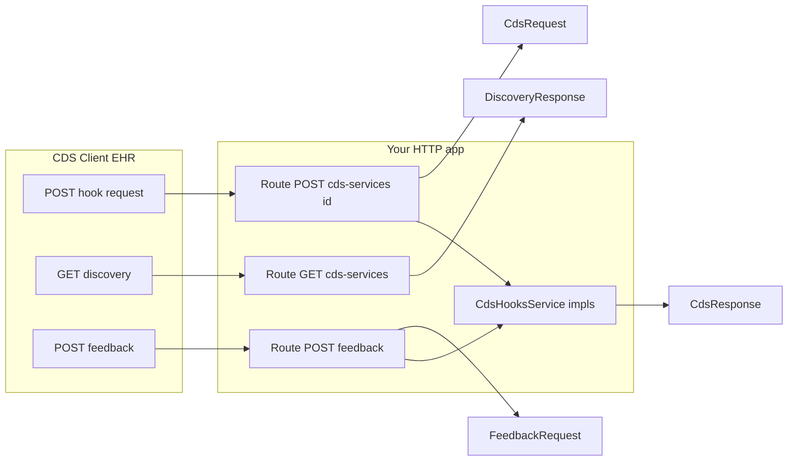
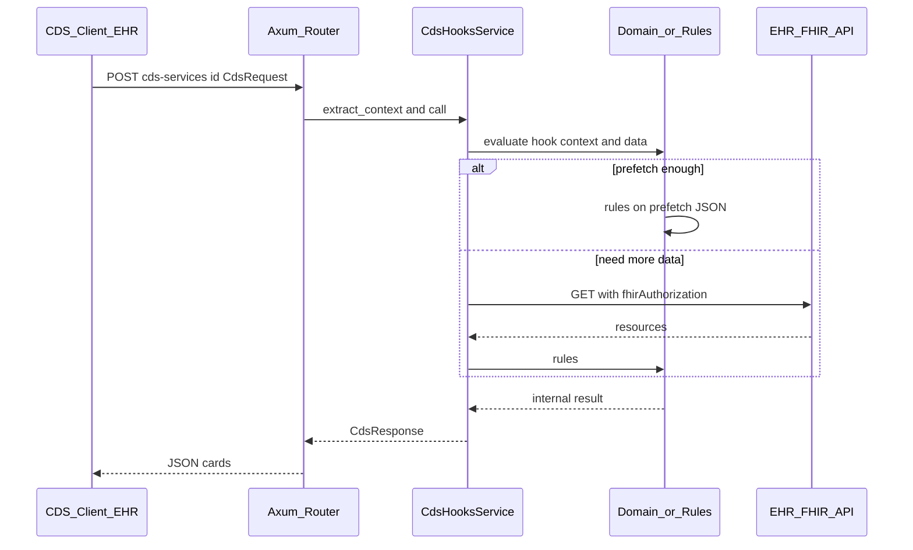

# Building a CDS Service with `helios-cds-hooks`

*Project copy of the design plan (kept in-repo for the team; Cursor plan may exist separately under `.cursor/plans/`).*

## What the crate implements (and what it does not)

**Implemented in this crate**

| Area | Details |
|------|--------|
| **Specification alignment** | Documented as [CDS Hooks v3.0.0-ballot](https://cds-hooks.hl7.org/) (see [crates/cds-hooks/src/lib.rs](../crates/cds-hooks/src/lib.rs) crate docs and [crates/cds-hooks/README.md](../crates/cds-hooks/README.md)). |
| **Discovery** | `DiscoveryResponse` and `CdsService` in [crates/cds-hooks/src/models.rs](../crates/cds-hooks/src/models.rs). |
| **Service (hook) invocation** | `CdsRequest` and `CdsResponse` in the same `models` module. |
| **Cards and actions** | Full card model, enums, `Card::info` / `warning` / `critical`, `CdsResponse::empty` / `with_cards`. |
| **Feedback** | `FeedbackRequest`, `Feedback`, related types. |
| **Hook contexts** | All library hooks in [crates/cds-hooks/src/hooks.rs](../crates/cds-hooks/src/hooks.rs). |
| **Service contract** | `CdsHooksService` in [crates/cds-hooks/src/service.rs](../crates/cds-hooks/src/service.rs). |
| **Errors** | `CdsHooksError` with `status_code()` → 400 / 412 / 500. |

**Not in this crate**

- No built-in **HTTP server** or **framework adapters** (Axum, Actix, etc.); you add routes in your binary or another crate.
- **TLS, OAuth/SMART**, and **calling the FHIR server** with `FhirAuthorization` are your application logic.

---

## How to build a CDS Service (wiring the three APIs)

1. **Add the dependency** — `helios-cds-hooks` from the workspace.
2. **Implement one `CdsHooksService` per advertised service** — `definition()`, `call()`, optional `on_feedback()`, `extract_context()`.
3. **Discovery** — `GET {baseUrl}/cds-services` → `DiscoveryResponse` JSON.
4. **Service** — `POST {baseUrl}/cds-services/{id}` → deserialize `CdsRequest`, dispatch, return `CdsResponse`; map `CdsHooksError` to HTTP.
5. **Feedback** — `POST {baseUrl}/cds-services/{id}/feedback` → `FeedbackRequest`, `on_feedback()`.
6. **Operational** — CORS, auth, rate limits, stable card/suggestion UUIDs for feedback.

---

## Quick reference: primary types

| Your responsibility | Crate type(s) |
|--------------------|----------------|
| List services | `DiscoveryResponse`, `CdsService` |
| Parse incoming hook POST | `CdsRequest` |
| Typed hook data | `*Context` in `hooks` + `HookContext` |
| Return guidance | `CdsResponse`, `Card`, … |
| Parse feedback POST | `FeedbackRequest` |
| Implement behavior | `CdsHooksService` |

Full examples: [crates/cds-hooks/README.md](../crates/cds-hooks/README.md).

---

## Using Axum: separate crate or not?

- **Not required:** a single package with Axum routes + handlers is enough to start.
- **Separate crate** makes sense for a deployable CDS microservice, reuse of rules without HTTP, or multiple entrypoints.

**Typical layout:** `helios-cds-hooks` (types) → [`cds-core`](../crates/cds-core) (evaluation, `CdsHooksService` impls, no HTTP) → [`cds-server`](../crates/cds-server) (Axum router) or your own HTTP shell.

---

## Who calls the hook? (Not your SPA by default)

The **CDS Client** is usually the **EHR**; it calls Discovery, POSTs hook requests, and sends Feedback. Production traffic is EHR-to-CDS at your **HTTPS** `baseUrl`. A custom “frontend” is usually a **test harness** simulating a CDS Client.

---

## End-to-end flow: hook → data → “what to return”

1. EHR **POSTs** `CdsRequest` with `context`, optional `prefetch`, optional `fhirServer` + `fhirAuthorization`.
2. **Axum handler** dispatches to the right `CdsHooksService` by `{id}`.
3. **Inside `call`:** use prefetch and/or call the EHR FHIR API with the token, run rules, return `CdsResponse`.
4. If required data is missing, `CdsHooksError::PreconditionFailed` → **412** (per crate).

---

## Keeping “huge” logic under control

Layer **Axum** → **thin `CdsHooksService` glue** → **domain/rules** (domain types, not `Card` directly) → **FHIR access** module. Split rules by feature or hook; use a `match` on service `id` or an enum of services. Move large rule sets to a separate library crate with tests; map to cards at the edge.

---

## External knowledge sources

Clinical CDS rarely implements **all** medical knowledge in-house. A common pattern is: gather patient/medication data from **prefetch** and/or the EHR **FHIR API**, call one or more **external knowledge or reasoning services**, then map results to CDS **`Card`** / **`Suggestion`**. Licensing, BAA (US HIPAA), intended-use, and geography vary by vendor—evaluate before integration.

### Drug interaction and medication safety

- **Licensed drug knowledge vendors** are the norm for **drug–drug interactions**, **dosing**, **duplicate therapy**, **drug–disease** checks, etc. Examples (not exhaustive): [FDB MedKnowledge / integration and Cloud Connector](https://www.fdbhealth.com/solutions/medknowledge-drug-database/integration-options), **Micromedex** and similar (often already licensed via the EHR), [DrugBank clinical / DDI API](https://www.drugbank.com/clinical/drug_drug_interaction_checker).
- **Terminology and open data** (e.g. NLM [RxNav](https://www.nlm.nih.gov/research/umls/rxnorm/docs/rxnav.html) / **RxNorm**) help with **coding and identity** of drugs; they are **not** a substitute for a full med-safety program unless you explicitly design a narrow scope and validation path.

**Your service still owns:** normalizing to vendor identifiers (RxNorm, NDC, product codes), **latency** and caching, **alert filtering** (reducing alert fatigue), audit logging, and mapping vendor severity text to `Indicator` / copy for cards.

### Labs, imaging appropriateness, and “what tests for this problem”

- There is **no single global public API** for “required tests for condition X” that all EHRs use. Real deployments mix **local order sets**, **quality / HEDIS** logic, **imaging-appropriateness** rules, and specialty pathways.
- **HL7** side: [FHIR Clinical Reasoning / CDS on FHIR (R5)](https://www.hl7.org/fhir/R5/clinicalreasoning-cds-on-fhir.html) describes mapping **hooks** to knowledge (e.g. `PlanDefinition`, prefetch as `DataRequirement`, evaluation). [GuidanceResponse (R5)](https://www.hl7.org/fhir/R5/guidanceresponse.html) is a structured container for guidance results (you may still present the same content as CDS **cards** after transformation).
- **Regional** health-system APIs (e.g. [NHS API / CDS - FHIR](https://developer.nhs.uk/apis/cds/)) are **country- and program-specific**, not a universal drop-in.

### Guideline-directed therapy and pathways

- **Narrative guidelines** (e.g. specialty-society, NICE) are often used through **licensed** clinical content products or manual curation, not a single free API.
- **Machine-executable** options include **CPG on FHIR**, **`PlanDefinition` + `$apply`**, and **vendor pathway** engines; these require governance, version control, and often institutional configuration.

### Differential diagnosis, triage, and symptom workup

- **Commercial APIs** exist (e.g. triage/DDx vendors such as **Isabel**, **Infermedica**; verify current offerings and **regulatory** framing). There is no universal public DDx endpoint.
- **Architecture:** treat each vendor as a **separate client module** with timeouts, idempotency where relevant, and mapping to your domain model before `Card` construction (same separation as for drug checks).

### Integration pattern (summary)

- One **small module per external system** (e.g. `integrations/drug_fdb`, `integrations/ddx_vendor`).
- Return **internal domain types** from those modules; a thin layer builds **`CdsResponse`** so CDS protocol types do not spread through all business rules.

---

## References

- [CDS Hooks specification](https://cds-hooks.hl7.org/)
- [CDS Hooks Library (hooks)](https://cds-hooks.hl7.org/hooks/)
- [FHIR Clinical Reasoning – CDS on FHIR (R5)](https://www.hl7.org/fhir/R5/clinicalreasoning-cds-on-fhir.html)
- [Crate README](../crates/cds-hooks/README.md)
