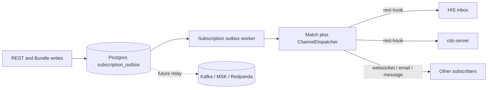
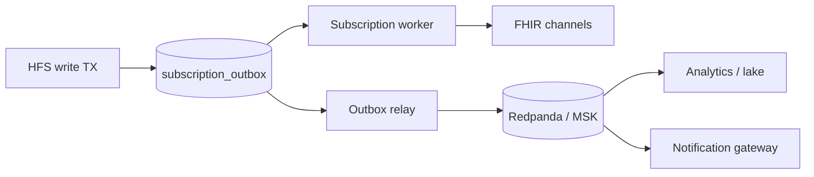

# Eventing broker readiness (Kafka / MSK / Redpanda)

**Status:** Decision deferred — Postgres transactional outbox is the production event log today.  
**Audience:** platform / ops deciding when to introduce a message broker beside HFS subscriptions.

This note captures *when* to adopt a broker, *what* is already broker-ready in HFS, and *how* a later relay would publish without changing the FHIR write path.

---

## Current architecture (no broker)



| Piece | Role today |
|-------|------------|
| `subscription_outbox` (Postgres/SQLite) | Same-TX durable log of resource changes; CloudEvents-style `envelope` JSON column |
| Outbox worker (`helios-subscriptions`) | Claims rows, matches SubscriptionTopics, dispatches via registered channels |
| FHIR Subscriptions | Primary fan-out to HIS, CDS, UIs — standards-based, not broker-specific |
| `$events` | Spec recovery for gap fill (subscribers); dead-lettered rows (`dead_at`) are not listed |

There is **no** Kafka, MSK, Redpanda, SQS, or RabbitMQ in the Atrius stack today. Staging remains a single-node Compose deployment.

Code anchors:

- Outbox model + envelope: `crates/persistence/src/core/subscription_outbox.rs`
- Postgres/SQLite stores: `crates/persistence/src/backends/*/subscription_outbox.rs`
- Channel registry: `crates/subscriptions/src/channels/mod.rs` (`ChannelDispatcherRegistry`, `SubscriptionEngine::with_dispatcher`)
- Runtime skill: `.claude/skills/work-with-subscriptions/SKILL.md`

---

## Decision: defer Kafka / Amazon MSK

**Recommendation: do not introduce MSK (or a multi-AZ Kafka cluster) yet.**

Why the outbox is enough for now:

1. **Topology** — one primary clinical writer (HFS) and a small set of first-party consumers (HIS, cds-server).
2. **Volume** — hospital event rates are far below the point where a broker’s partitioning model pays for itself.
3. **Cost** — provisioned MSK multi-AZ has a high floor (often hundreds of USD/month before useful consumers); Serverless MSK is still a new ops surface.
4. **Capabilities already covered** — durability (same-TX outbox), at-least-once delivery, per-subscription ordering/event numbers, replay via `$events`, and subscriber attachment via Subscription resources (no HFS code change per consumer).

A broker becomes valuable when **independent teams/processes** need long-lived, offset-based consumption of the *same* change stream — not when you only need “notify HIS and CDS.”

---

## Adoption triggers

Adopt a broker (start with Redpanda-on-EC2 or SQS; promote to MSK only if Amazon-managed ops is required) when **any** of the following become true:

| Trigger | Why a broker helps |
|---------|-------------------|
| Multiple independent consumers need replay from arbitrary offsets (analytics, lake, ML feature pipelines, audit warehouse) | Outbox + `$events` is FHIR-subscriber oriented; brokers give consumer groups and retention |
| Multi-node HFS behind a load balancer with shared Postgres | Still fine with outbox alone, but a relay off the outbox becomes the natural cross-service bus |
| Sustained event rates beyond a few hundred/sec with many slow consumers | Back-pressure and partition parallelism |
| Org boundary: a separate team owns consumers and must not depend on FHIR Subscription rest-hooks | Kafka ACLs / topics as the contract |
| Mobile notification gateway + analytics + CDS all want the same stream with different lag SLAs | One publish path, many consumer groups |

**Non-triggers** (do *not* add a broker for these alone):

- Replacing HIS rest-hooks “because Kafka is modern”
- Single-consumer bed-board / worklist freshness (SSE + inbox is enough)
- Hoping MSK will fix Subscription matching gaps (e.g. unevaluated `fhirPathCriteria`)

---

## Stepping stones (cheaper than MSK)

Prefer this order if a trigger fires:

1. **Redpanda on the existing EC2 (or a sibling box)** — Kafka API compatible, single-binary ops, good for “prove the relay” without AWS MSK cost.
2. **Amazon SQS (+ optional SNS fan-out)** — simpler ops if you only need queue semantics and don’t need Kafka ecosystem tools.
3. **Amazon MSK / MSK Serverless** — when you need managed multi-AZ Kafka, IAM integration, and multiple AWS accounts consuming the same topics.

Do **not** dual-write from the HFS request path to the broker. Always **relay from the outbox** (see below) so the FHIR write TX remains the source of truth.

---

## CloudEvents-style outbox envelope

Every outbox row stores a JSON `envelope` built by `SubscriptionOutboxEntry::envelope`. Shape (CloudEvents 1.0 attributes + `data`):

```json
{
  "specversion": "1.0",
  "id": "<event_id UUID>",
  "source": "<HFS_BASE_URL or \"hfs\">",
  "type": "com.helios.hfs.fhir.resource.change",
  "time": "<RFC3339 created_at>",
  "datacontenttype": "application/json",
  "data": {
    "tenantId": "<tenant>",
    "fhirVersion": "4.0",
    "resourceType": "Encounter",
    "resourceId": "enc-123",
    "versionId": "2",
    "eventType": "create|update|delete",
    "resource": { },
    "previousResource": { }
  }
}
```

| Field | Notes |
|-------|--------|
| `type` | Constant `com.helios.hfs.fhir.resource.change` (`OUTBOX_EVENT_TYPE`) |
| `source` | From `HFS_BASE_URL` (`subscription_outbox_source()`) |
| `id` | Stable `event_id`; use as broker message key *or* as idempotency key downstream |
| `data.resource` / `previousResource` | May contain PHI — treat broker topics as clinical data plane |

**Stability promise for relay authors:** keep this envelope schema additive-only. New optional fields are OK; renaming/removing `data.*` keys or changing `type` requires a versioned `type` URI (e.g. `.v2`).

Suggested broker message conventions (when the relay exists):

| Concern | Suggestion |
|---------|------------|
| Topic | `atrius.fhir.resource.change` (or per-tenant suffix if isolation requires it) |
| Key | `{tenantId}:{resourceType}/{resourceId}` for partition locality per resource |
| Headers | Mirror CloudEvents attrs (`ce_id`, `ce_type`, `ce_source`, `ce_time`) if using Kafka CE binding |
| Idempotency | Consumers key on `id` / `event_id` |
| PHI | Encrypt at rest; restrict ACLs; prefer id-only fan-out to untrusted networks |

---

## Outbox → broker relay (future)

Intended pattern (not implemented):

1. A small **outbox relay** process (or HFS sidecar task) tails `subscription_outbox` for rows that are `processed` (or a dedicated `published_at` column added later). Skip `dead_at IS NOT NULL` — those claims exhausted retries and were tombstoned.
2. For each row, publish `envelope` to the broker **exactly once** from the relay’s perspective (store broker offset / outbox id in a `outbox_publish` table, or use transactional outbox → Kafka connect patterns).
3. FHIR Subscription dispatch **continues to run as today** for clinical subscribers; the broker is an *additional* fan-out for analytics/gateway teams — not a replacement for Subscriptions unless you deliberately migrate a consumer.



**Write-path rule:** resource persist + outbox insert stay in one SQL transaction. The relay never participates in that TX.

---

## Custom channel vs relay

Two complementary extension points:

| Approach | Use when |
|----------|----------|
| **Outbox relay → broker** | Many consumer groups, analytics, team isolation, long retention |
| **`ChannelDispatcher` registration** (`SubscriptionEngine::with_dispatcher`) | A FHIR Subscription channel type that publishes to Kafka for *Subscription* subscribers who opted into a custom channel |

Prefer the **relay** for platform-wide change streams. Prefer a **custom dispatcher** only if the contract must remain “create a Subscription resource pointing at a Kafka-backed channel.”

---

## Relationship to HIS messaging

| Path | Semantics |
|------|-----------|
| HFS Subscriptions + outbox | Notification / best-effort clinical fan-out |
| HIS `POST /$process-message` | Consequence messaging with R4 reliable-messaging dedup |
| Future broker | Platform event bus; does **not** replace `$process-message` for LIS/PACS consequence workflows |

Gateways and ABDM/NHCX-style exchanges should keep using FHIR Messaging (or REST) for consequence; they may *also* consume broker topics for observability later.

---

## Checklist before introducing a broker

- [ ] At least one adoption trigger above is real (named consumers + owners).
- [ ] Envelope schema reviewed; PHI classification agreed for topic ACLs.
- [ ] Relay design: publish-after-outbox, idempotent on `event_id`, no dual-write from handlers.
- [ ] FHIR Subscription path remains green for HIS/CDS (broker is additive).
- [ ] Cost model compared: Redpanda/SQS vs MSK for the actual retention and consumer count.
- [ ] Runbook: topic retention, DLQ / poison messages, replay procedure.

---

## Related

- Plan: `AtriusIGDraft/.cursor/plans/fhir_subscriptions_and_messaging_integration_82b0106e.plan.md` (Phase 4)
- HIS inbox / `$process-message`: `atrius-his/docs/production-architecture.md`
- Subscriptions ops: `.claude/skills/work-with-subscriptions/SKILL.md`
