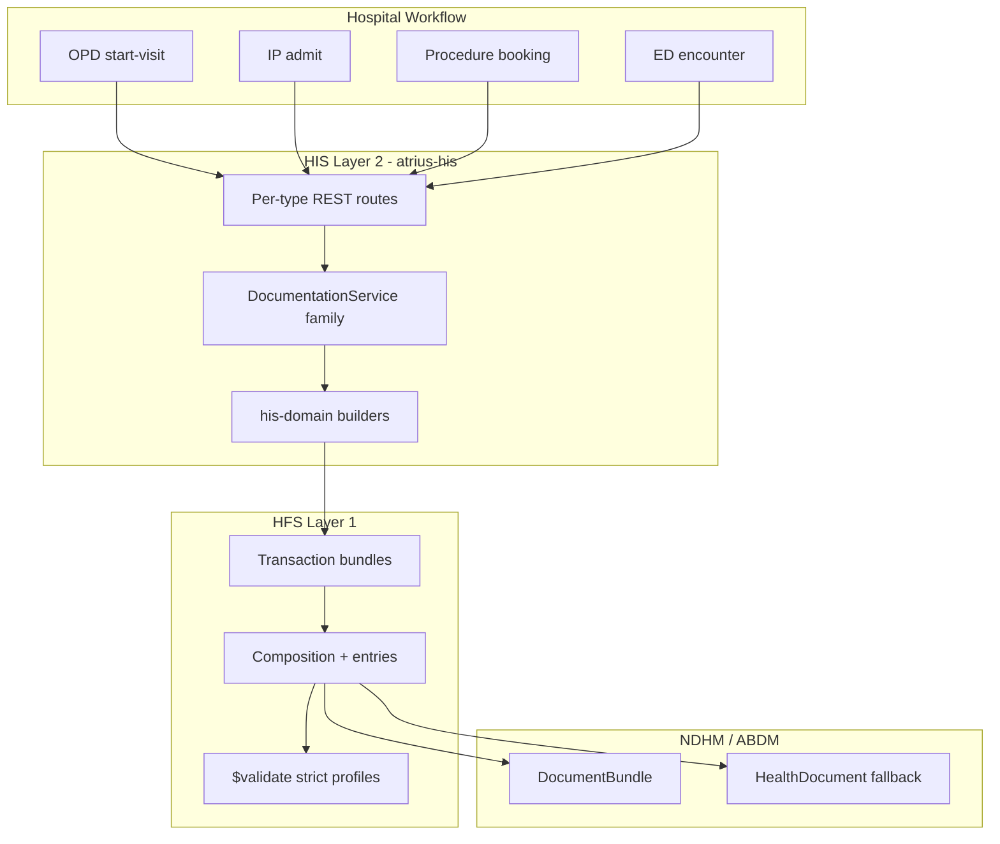
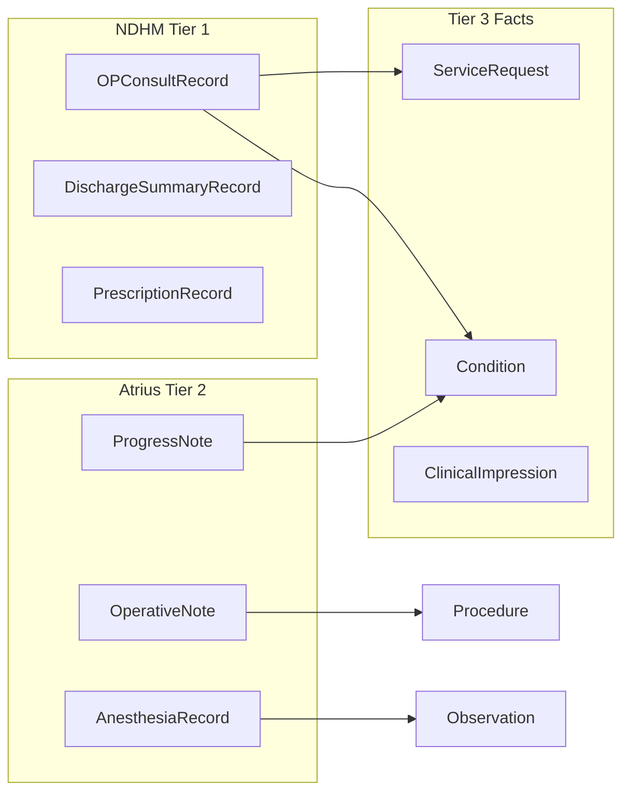
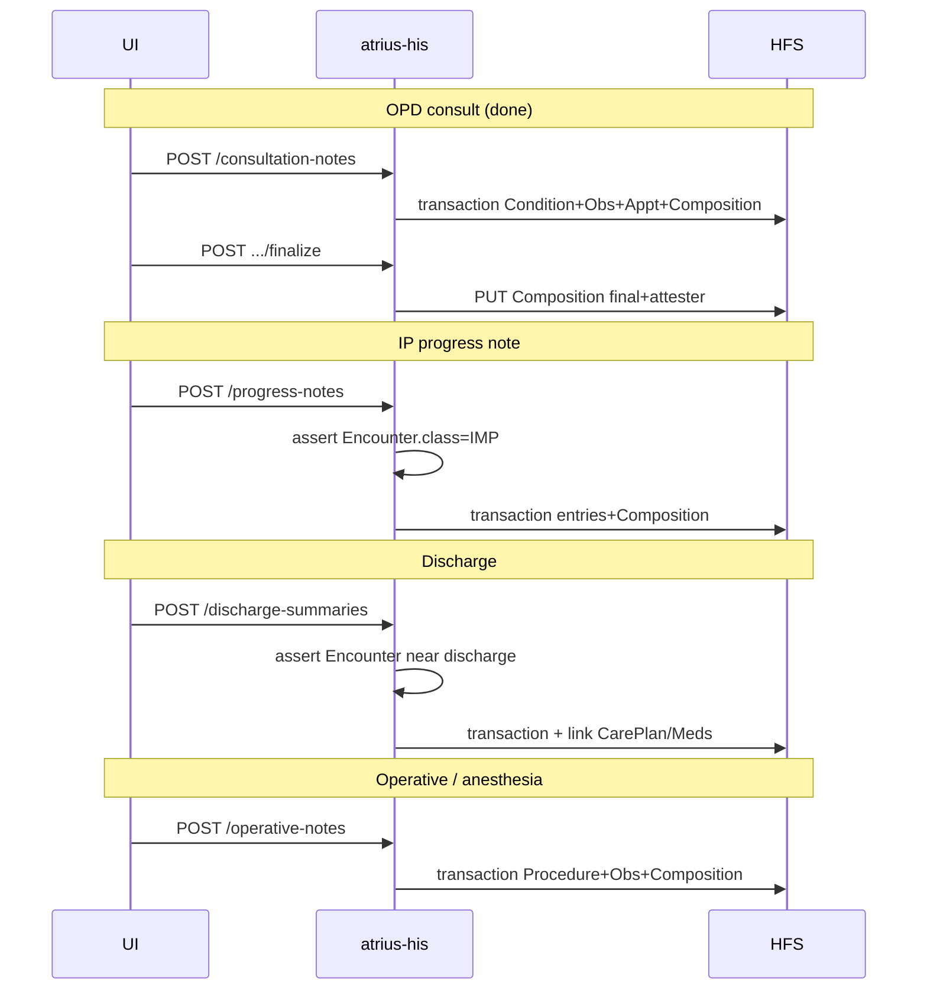

# Clinical Documentation Architecture Plan

## Design principles

1. **Composition is the clinical document shell** for anything structured, signable, and sectioned. This matches NDHM/ABDM (8 record types + `DocumentBundle` exchange) and your existing Phase 5a implementation.
2. **Section entries hold structured facts** — `Condition`, `Observation`, `Procedure`, `ServiceRequest`, etc. — not prose trapped only in `Composition.section.text`. Narrative (`section.text.div`) is generated for human reading; entries power search, CDS, and quality reporting.
3. **Parent FHIR R4, not NDHM SDs** — Atrius profiles in [`AtriusIGDraft/input/fsh/composition-records.fsh`](/Users/sandhu/AtriusIGDraft/input/fsh/composition-records.fsh) parent `Composition` directly with NDHM-equivalent constraints (already established).
4. **Ordered `openAtEnd` slicing** — all value-sliced section profiles must set `^slicing.ordered = true`; builders must emit sections in **profile declaration order** (lesson from smoke test).
5. **Transaction bundles for writes** — create/update = entry resources + Composition atomically via HFS `POST/PUT` transaction (pattern in [`atrius-his/crates/his-domain/src/documentation.rs`](/Users/sandhu/RustroverProjects/atrius-his/crates/his-domain/src/documentation.rs)).
6. **Encounter-scoped lifecycle** — every note links `Composition.encounter`; draft (`preliminary`) → finalize (`final` + attester) → optional amend (`amended` + new version) tied to workflow state (OPD visit, IP admission, OR case).



---

## Taxonomy: note types → FHIR artifacts

### Tier 1 — NDHM-aligned Composition records (ABDM exchange-ready)

These are already defined (fully or partially) in the IG. **Implement builders + APIs in priority order.**

| Hospital note / artifact | Atrius profile | NDHM record | Section pattern | Primary entry types |
|---|---|---|---|---|
| OPD consult / specialty consult | `atrius-in-op-consult-record` | OPConsultRecord | 12 SNOMED section slices | Condition, Observation, AllergyIntolerance, ServiceRequest, Procedure, Appointment, … |
| Discharge summary | `atrius-in-discharge-summary-record` | DischargeSummaryRecord | 10 SNOMED slices | + DiagnosticReport, CarePlan |
| Wellness / health check | `atrius-in-wellness-record` | WellnessRecord | Title slices | Observation (vitals, lifestyle, …) |
| Lab / imaging report document | `atrius-in-diagnostic-report-record` | DiagnosticReportRecord | Entry slices on `section.entry` | DiagnosticReport, DocumentReference |
| Prescription / e-Rx | `atrius-in-prescription-record` | PrescriptionRecord | Entry slices | MedicationRequest, Binary |
| Immunization record | `atrius-in-immunization-record` | ImmunizationRecord | Entry slices | Immunization, ImmunizationRecommendation |
| Unstructured upload | `atrius-in-health-document-record` | HealthDocumentRecord | Single section | DocumentReference |
| Billing invoice doc | *(missing — add later)* | InvoiceRecord | Single section | Invoice |

**Specialty consult note:** Do **not** create separate Composition profiles per specialty initially. Use **`atrius-in-op-consult-record`** with:
- `Encounter.serviceType` / `PractitionerRole.specialty` for specialty context
- Optional `DocumentReference` section for attachments
- Same API with `title` + specialty metadata on the request

**Referral note:** Usually **not a separate Composition type**. Model as:
- `ServiceRequest` (category=referral) via Orders module (Phase 5b)
- Optional OP consult **`Referral` section slice** (SNOMED `306206005`) when embedded in a consult note

### Tier 2 — Atrius Composition extensions (structured, not yet NDHM)

Define section slicing in IG; exchange externally via `DocumentBundle` today, `HealthDocumentRecord` fallback if profile not accepted.

| Hospital note | Proposed profile | Workflow anchor | Suggested sections (SNOMED or title slices) |
|---|---|---|---|
| IP daily progress note | `atrius-in-inpatient-progress-note` *(placeholder exists)* | IP Encounter (`class=IMP`) | Subjective, Objective, Assessment, Plan; Vitals; Labs summary; Active problems |
| IP / dept procedure note | `atrius-in-inpatient-procedure-note` *(placeholder exists)* | Encounter + `Procedure` focus | Indication, Consent, Procedure performed, Findings, Complications, Post-op orders |
| Operative note | **new** `atrius-in-operative-note` | Surgical Encounter / Procedure | Pre-op diagnosis, Procedure, Findings, Specimens, Implants, Closure, Post-op plan |
| Anesthesia record | **new** `atrius-in-anesthesia-record` | Surgical Encounter | Pre-anesthesia eval, Airway, Agents, Vitals timeline, Events, PACU handoff |
| Nursing assessment / flow sheet | **new** `atrius-in-nursing-note` | IP Encounter + Location | Assessment, Interventions, Response; link vitals Observations |
| ED note | **new** `atrius-in-ed-note` or reuse OP consult | ED Encounter (`class=EMER`) | Triage, HPI, Exam, MDM, Disposition |

### Tier 3 — Standalone clinical resources (not Composition-first)

Use when the artifact is a **fact** or **order**, not a signed document bundle.

| Use case | Primary resource | When Composition is unnecessary |
|---|---|---|
| Problem list item | `Condition` | Already persisted; note references it |
| Allergy | `AllergyIntolerance` | Documented once; referenced from consult sections |
| Assessment without full note | `ClinicalImpression` | Quick ED triage score, nursing screen — link to Encounter; promote to Composition when signing |
| Adverse event | `AdverseEvent` | Safety reporting workflow |
| Scanned legacy PDF | `DocumentReference` | `HealthDocumentRecord` wrapper for NDHM export only |

**Rule of thumb:** If it must be **signed, versioned, and exported as a clinical document**, use Composition. If it is a **discrete clinical fact** consumed by other notes/orders, use the underlying resource directly and reference it from Composition sections.



---

## NDHM section patterns (IG + builder contract)

Three mechanical patterns to implement once, reuse everywhere:

| Pattern | Profiles | Builder responsibility |
|---|---|---|
| **A — SNOMED section slices** | OP consult, Discharge | `SliceDef { slice_name, snomed_code, entry_profiles[], resource_builder }`; emit in **profile order** |
| **B — Title section slices** | Wellness | Same as A but discriminator on `section.title` |
| **C — Entry-type slices** | Prescription, DiagnosticReport, Immunization | One `Composition.section`; slice `section.entry` by resource type (`MedicationRequest`, `DiagnosticReport`, …) |

**IG gaps to close** (header-only profiles today in [`composition-records.fsh`](/Users/sandhu/AtriusIGDraft/input/fsh/composition-records.fsh)):
- Complete entry slicing for DiagnosticReport, Prescription, Immunization, HealthDocument
- Add `atrius-in-invoice-record` if billing docs needed
- Flesh out inpatient/operative/anesthesia profiles with section slices + entry constraints

---

## Idiomatic Rust structure (extend Phase 5a)

### Crate layout

```
atrius-his/crates/
  his-domain/
    src/
      clinical/                    # NEW module tree
        mod.rs
        lifecycle.rs               # Draft/Final/Amend, attester helpers
        slice.rs                   # SliceDef, SectionPattern enum
        entry_builders.rs          # narrative_condition, narrative_observation, …
        specs/                     # One file per document kind
          op_consult.rs            # OP_CONSULT_SLICES + spec impl
          discharge_summary.rs
          progress_note.rs
          operative_note.rs
          ...
        transaction.rs             # Generic build_transaction(spec, sections, ids)
      profiles.rs                  # Profile URL constants (existing)
  his-documentation/
    src/
      service.rs                   # Generic ClinicalDocumentService or typed methods
      kinds.rs                     # ClinicalDocumentKind enum + validation rules
      error.rs
  his-server/
    src/routes/
      documentation/
        mod.rs
        consultation_notes.rs      # Existing routes (thin)
        discharge_summaries.rs     # Future
        progress_notes.rs          # Future
```

### Core types (recommended)

```rust
// kinds.rs — workflow + profile dispatch
pub enum ClinicalDocumentKind {
    OpConsult,
    DischargeSummary,
    InpatientProgressNote,
    InpatientProcedureNote,
    OperativeNote,
    AnesthesiaRecord,
    // NDHM others…
}

// slice.rs — shared slice metadata (generalize OpConsultSlice)
pub struct SliceDef<S> {
    pub slice: &'static str,
    pub title: &'static str,
    pub code: SectionCode,           // Snomed | Title
    pub field: fn(&S) -> Option<&String>,
    pub entry: EntryKind,
}

pub enum SectionCode {
    Snomed { code: &'static str, display: &'static str },
    Title(&'static str),
}

// specs/op_consult.rs
pub trait ClinicalDocumentSpec {
    const KIND: ClinicalDocumentKind;
    const PROFILE: &'static str;
    const COMPOSITION_TYPE: SnomedType;
    const SECTION_PATTERN: SectionPattern;
    type Sections: Default + Serialize + Deserialize;
    fn slices() -> &'static [SliceDef<Self::Sections>];
}
```

**Why traits + const slices:** Compile-time slice tables (like today's `OP_CONSULT_SLICES`), testable slice-order invariants, no runtime profile parsing in builders. Each note type is ~1 spec file + thin service methods.

### Shared lifecycle (all note types)

| State | Composition.status | Who can edit | Service rules |
|---|---|---|---|
| Draft | `preliminary` | Author / same role | One draft per (encounter, kind) optional per policy |
| Final | `final` | Read-only | `attester.mode=professional` |
| Amended | `amended` | New preliminary copy or PATCH policy TBD | Retain history via HFS versioning |

Extract from [`documentation.rs`](/Users/sandhu/RustroverProjects/atrius-his/crates/his-domain/src/documentation.rs):
- `build_*_transaction` / `*_update_transaction`
- `finalize_*_composition`
- `composition_from_transaction_response`
- Section order test per spec

### API shape (recommended default: hybrid)

- **Internal:** `ClinicalDocumentSpec` trait + shared transaction builder
- **External:** Per-type routes for clear OpenAPI and UI modules (keep `/consultation-notes`; add `/discharge-summaries`, `/progress-notes`, …)
- **Optional later:** `GET /encounters/{id}/clinical-documents` aggregator search across Composition profiles

Common request shape:

```json
{
  "encounter_id": "enc-…",
  "practitioner_id": "dr-patel",
  "title": "…",
  "sections": { /* kind-specific */ }
}
```

---

## Hospital workflow mapping



| Workflow | Preconditions | Allowed document kinds | Encounter class |
|---|---|---|---|
| OPD visit | `start-visit` done | OP consult, Prescription, Wellness | `AMB` |
| IP admission | ADT admit | Progress note, Procedure note, Nursing note | `IMP` |
| Surgery | Procedure scheduled / in-progress | Operative note, Anesthesia record, Procedure note | `IMP` / `AMB` day case |
| Discharge | Active IP encounter | Discharge summary | `IMP` |
| ED | ED registration | ED note or OP consult pattern | `EMER` |
| External share | Final document | `DocumentBundle` export | Any |

**Cross-cutting rules:**
- Validate `Composition.meta.profile` on every write (HFS strict mode)
- Run `$validate` in smoke tests per kind (pattern from [`smoke-consult-note.sh`](/Users/sandhu/RustroverProjects/atrius-his/scripts/smoke-consult-note.sh))
- Link orders (Phase 5b) to note sections: lab orders → `InvestigationAdvice`; referrals → `Referral` slice or standalone `ServiceRequest`

---

## NDHM export path

For ABDM sharing, wrap any final Composition:

```
DocumentBundle (type=document)
  entry[0]: Composition
  entry[1..n]: Patient, Encounter, Practitioner, section entry resources
```

Implemented in `his-domain/clinical/document_bundle.rs`; exposed per document type as `POST /api/v1/{kind}/{id}/export`.

For **non-NDHM notes** (operative, anesthesia): store structured Atrius Composition in HFS; export as **`HealthDocumentRecord`** (PDF + DocumentReference) or raw `DocumentBundle` with Atrius profile URL when exchanging with partners that accept it.

---

## Implementation roadmap

### Phase 5a+ — Harden OP consult (optional)
- Add amend flow + version history policy
- Domain unit tests for slice order per spec

### Phase 5c — NDHM record parity ✓

| Record | Pattern | Status |
|--------|---------|--------|
| Discharge summary | A | ✓ |
| Prescription record | C | ✓ |
| Immunization record | C | ✓ |
| Wellness record | B | ✓ |
| Invoice record | C | ✓ |
| Diagnostic report record | C | Pending (Phase 6 LIS) |
| Health document | D | Pending |

### Phase 5d — Inpatient & procedural notes ✓

APIs: `/progress-notes`, `/procedure-notes`, `/operative-notes`, `/anesthesia-records` — all with create/read/update/finalize/export.

**Smoke:** [`smoke-clinical-documents.sh`](/Users/sandhu/RustroverProjects/atrius-his/scripts/smoke-clinical-documents.sh) (OPD + IP paths, 8 kinds).

### Phase 5e — ED, nursing, unstructured (later)
- ED note profile or OP consult variant
- Nursing note + vitals Observation linking
- `ClinicalImpression` for lightweight screens that promote to signed Composition

### Platform enablers (parallel)
- HTS: seed SNOMED section/type codes to reduce binding warnings (optional)
- HFS validator: slice-aware rules (done for targetProfile); extend to other sliced constraints as needed
- Subscriptions: `composition-finalized` for billing, HIE, task completion

---

## Testing strategy

| Layer | What to test |
|---|---|
| `his-domain` | Slice order, transaction size, profile URL, entry resource types per spec |
| `his-documentation` | Encounter state guards, one-draft policy, finalize idempotency |
| Integration | `$validate` against manifest for each kind |
| Smoke | [`smoke-consult-note.sh`](/Users/sandhu/RustroverProjects/atrius-his/scripts/smoke-consult-note.sh) ✓, [`smoke-discharge-summary.sh`](/Users/sandhu/RustroverProjects/atrius-his/scripts/smoke-discharge-summary.sh) ✓, [`smoke-clinical-documents.sh`](/Users/sandhu/RustroverProjects/atrius-his/scripts/smoke-clinical-documents.sh) ✓ |

---

## Key files to evolve

| Area | File |
|---|---|
| IG profiles | [`AtriusIGDraft/input/fsh/composition-records.fsh`](/Users/sandhu/AtriusIGDraft/input/fsh/composition-records.fsh) |
| Profile constants | [`atrius-his/crates/his-domain/src/profiles.rs`](/Users/sandhu/RustroverProjects/atrius-his/crates/his-domain/src/profiles.rs) |
| Builders | [`atrius-his/crates/his-domain/src/clinical/`](/Users/sandhu/RustroverProjects/atrius-his/crates/his-domain/src/clinical/) (`specs/`, `slice.rs`, `transaction.rs`, `document_bundle.rs`) |
| Service pattern | [`atrius-his/crates/his-documentation/`](/Users/sandhu/RustroverProjects/atrius-his/crates/his-documentation/) (`service.rs`, `clinical_documents.rs`) |
| Living plan | [`atrius-hfs/docs/his/fhir-native-his-plan.md`](/Users/sandhu/RustroverProjects/atrius-hfs/docs/his/fhir-native-his-plan.md) — extend Phase 5 beyond 5a/5b |

---

## Summary decision (defaults)

- **Structure:** Composition + section entries for all signable clinical documents; standalone resources for facts and orders.
- **NDHM:** Implement all 8 record types in IG; prioritize discharge + prescription after OP consult.
- **Gaps (operative, anesthesia, progress):** Atrius Composition profiles with section slicing; external exchange via DocumentBundle or HealthDocument fallback.
- **Rust:** Trait + const slice tables + shared transaction/lifecycle module; per-type HTTP routes.
- **Specialty consults:** Same OP consult profile; specialty on Encounter/PractitionerRole, not separate IG profiles.
