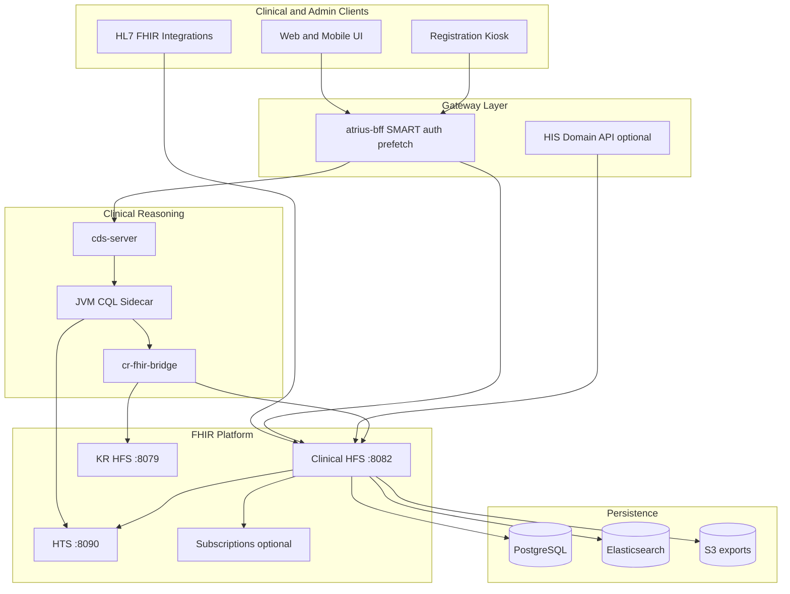
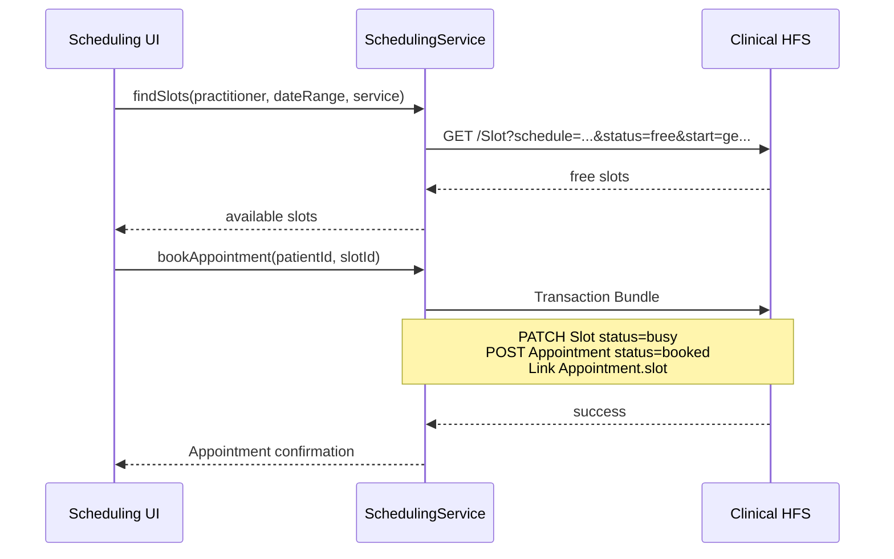
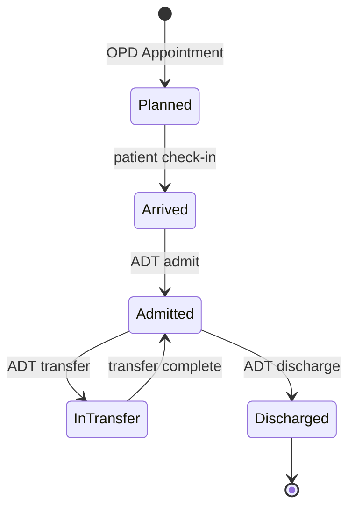

# FHIR-Native Hospital Information System — Comprehensive Plan

> **Status:** Draft for review (2026-06). Stepwise implementation to follow phase order below.

## Executive summary

This repo already provides a **strong FHIR platform layer**: full R4 resource types ([`crates/fhir`](../../crates/fhir)), generic REST server ([`crates/rest`](../../crates/rest)), persistence with multi-tenancy ([`crates/persistence`](../../crates/persistence)), profile validation ([`crates/fhir-validation`](../../crates/fhir-validation)), terminology ([`crates/hts`](../../crates/hts)), bulk export, optional subscriptions, and a clinical reasoning stack ([`docs/clinical-reasoning/README.md`](../clinical-reasoning/README.md)).

What it is **not yet**: a Hospital Information System. HFS stores and searches FHIR resources; it does not implement **operational semantics**—slot locking, appointment booking pipelines, ADT state machines, bed management, staff rostering, or order fulfillment workflows.

The path forward is **FHIR-native by design**: model hospital operations as standard (and Atrius-profiled) FHIR resources, enforce IGs at write time, drive workflows via **Task + PlanDefinition + Subscriptions**, and expose **domain services** (Rust microservices or a BFF) that orchestrate multi-resource transactions against HFS.



---

## What you have today (reuse, don't rebuild)

| Capability | Component | Hospital relevance |
|------------|-----------|-------------------|
| FHIR CRUD + search + history | HFS + helios-rest | All modules store data here |
| Multi-tenant isolation | `TenantContext` in persistence | Hospital groups, departments |
| Profile validation | `fhir-validation` + `HFS_PROFILE_MANIFEST` | Enforce Atrius/NDHM profiles on writes |
| Terminology | HTS | Code validation, `:in` search, CQL ValueSets |
| Batch/transaction bundles | HFS | Atomic multi-resource writes (register patient + encounter) |
| Bulk export | HFS `$export` | Analytics, reporting, data lake |
| Subscriptions (opt-in) | `helios-subscriptions` | ADT events, task assignment notifications |
| SMART auth (opt-in) | `helios-auth` + Keycloak | Role-based access in production |
| Clinical pathways | cds-server + sidecar + bridge | ED protocols, order sets, eCQM |
| Atrius profiles (57) | AtriusIGDraft + runtime-mapper | Encounter, ServiceRequest, Task, etc. |
| Audit trail | `helios-audit` | Compliance |

**Critical gaps for hospital ops** (must be built):

- No **Scheduling IG operations** (`$find`, `$book`, `$hold`) — only CRUD on Appointment/Schedule/Slot
- No **ADT workflow** — Encounter CRUD without admit/transfer/discharge orchestration
- No **Task lifecycle operations** (`$accept`, `$start`, `$complete`) — Task is passive storage
- No **Appointment / EpisodeOfCare Atrius profiles** yet
- No **MPI / patient match** (`$match`, `$everything`, merge)
- **UI/BFF** for admin workflows lives mostly outside this repo ([`atrius-bff`](../clinical-reasoning/forward-plan.md), `atrius-clinical-ui`)

---

## Target architecture: three layers

### Layer 1 — FHIR Platform (existing, harden for production)

Single **Clinical HFS** instance per environment (PostgreSQL + Elasticsearch recommended for hospital scale):

```bash
HFS_STORAGE_BACKEND=postgres-elasticsearch
HFS_DATABASE_URL=postgresql://...
HFS_ELASTICSEARCH_NODES=http://...
HFS_AUTH_ENABLED=true
HFS_PROFILE_MANIFEST=manifests/atrius-r4-profile-manifest-core.json
HFS_PROFILE_VALIDATION_MODE=strict
HFS_TERMINOLOGY_SERVER=http://hts:8090
HFS_SUBSCRIPTIONS_ENABLED=true
```

Separate **KR HFS** for definitional artifacts (PlanDefinition, ActivityDefinition, Library, Measure) and **HTS** for terminology — same pattern as [clinical reasoning startup guide](../clinical-reasoning/startup-guide.md).

### Layer 2 — HIS Domain Services (new)

Thin orchestration services that encode **hospital business rules** and write FHIR bundles to HFS. Recommended as a new crate/binary in this repo or a sibling repo (`atrius-his` / extend `atrius-bff`):

| Service module | FHIR resources orchestrated | Key operations |
|----------------|----------------------------|----------------|
| **Registration** | Patient, RelatedPerson, Coverage, Consent | Register, update demographics, identifier assignment, `$match` dedup |
| **Scheduling** | Schedule, Slot, Appointment, HealthcareService | Find availability, book, cancel, reschedule, waitlist |
| **ADT** | Encounter, Location, EpisodeOfCare, Account | Admit, transfer, discharge, bed assignment |
| **Staffing** | Practitioner, PractitionerRole, Task, Basic (shift) | Duty roster, task assignment, handoff |
| **Orders** | ServiceRequest, MedicationRequest, Task | Order entry, fulfillment tracking (extends existing ActivityDefinition `$apply`) |

Each module exposes **REST APIs** (OpenAPI) that internally compose **FHIR transaction bundles** — keeping HFS as the system of record.

### Layer 3 — Client applications (external repos)

- **atrius-bff**: SMART auth, prefetch, session context — already exists for CDS
- **atrius-clinical-ui**: Clinician-facing UI — partial RequestGroup renderer exists
- **New admin UI**: Registration desk, scheduling board, bed management, staff roster — FHIR-native SPA consuming BFF + domain APIs

---

## Phase 0 — Foundation (weeks 1–4)

**Goal:** Production-grade platform all modules depend on.

### 0.1 Infrastructure baseline

- Deploy **PostgreSQL + Elasticsearch** (or postgres-only for pilot; ES improves chained search for scheduling)
- Enable **SMART auth** via Keycloak ([`docker/keycloak/`](../../docker/keycloak/))
- Map SMART scopes to hospital roles: `patient/*.read`, `patient/*.write`, `user/*.read`, compartment-aware access
- Enable **strict profile validation** with expanded Atrius manifest
- Enable **audit logging** (`HFS_AUDIT_*`)
- Define **tenant model**: one tenant per hospital, or org hierarchy via Organization + tenant routing

### 0.2 IG authoring in AtriusIGDraft (external)

Extend profiles for hospital operations not yet covered:

| Resource | New Atrius profile needs |
|----------|-------------------------|
| **Appointment** | OPD/IPD visit types, status lifecycle, slot linkage, service type |
| **EpisodeOfCare** | Care program enrollment (chronic disease, maternity) |
| **Encounter** | ADT extensions: admission source, discharge disposition, bed/ward refs |
| **Location** | Bed, ward, room, department hierarchy; occupancy status extension |
| **Task** | Nursing tasks, duty assignments, shift handoff; owner/period constraints |
| **Basic** | Shift roster, bed status board (common FHIR pattern for non-clinical admin) |

Publish manifest updates consumed by HFS via `HFS_PROFILE_MANIFEST`.

### 0.3 Terminology import

Follow [data-import.md](../clinical-reasoning/data-import.md):

- SNOMED CT, LOINC, ICD-10-CM, RxNorm via HTS import
- Hospital-specific ValueSets (departments, appointment types, admission types)
- Align `HFS_TERMINOLOGY_SERVER` and sidecar `htsBaseUrl`

### 0.4 Seed reference data

Transaction bundles to bootstrap a hospital:

- **Organization** (hospital, departments)
- **Location** (campus → building → ward → room → bed)
- **Practitioner** + **PractitionerRole** (consultants, nurses, admin)
- **HealthcareService** (OPD clinics, ED, radiology)
- **Schedule** + **Slot** templates (recurring availability)

Script pattern: extend [`scripts/import-synthea-atrius.py`](../../scripts/import-synthea-atrius.py) or create `scripts/seed-hospital-foundation.py`.

---

## Phase 1 — Patient Registration & MPI (weeks 5–8)

**Goal:** Register new patients with validated demographics and identifiers.

### FHIR resource model

```
Patient (atrius-patient profile)
  ├── identifier: MRN, Aadhaar/ABHA (NDHM), passport, insurance ID
  ├── name, telecom, address, birthDate, gender
  ├── contact (RelatedPerson)
  └── managingOrganization → Organization

Coverage (optional at registration)
Consent (data sharing, treatment)
```

### Domain service: `RegistrationService`

| Operation | Implementation |
|-----------|----------------|
| **Register patient** | Validate → create Patient (+ RelatedPerson) in transaction → return MRN |
| **Search / lookup** | Delegate to HFS `GET /Patient?name=...&identifier=...` |
| **Update demographics** | HFS PUT/PATCH with validation |
| **Duplicate check** | HFS search by identifier + fuzzy name/DOB; future: implement `$match` |
| **Merge** (later) | Patient merge operation — not in HFS today; design as domain service with provenance |

### Validation gates

- `HFS_PROFILE_VALIDATION_MODE=strict` on Patient writes
- HTS `$validate-code` for identifier type codes, gender, marital status
- Business rules in domain service: required fields, age constraints, duplicate policy

### UI

- Registration desk form → BFF → RegistrationService → HFS
- Print/export: Composition or DocumentReference for registration summary (later)

### Integration point

- NDHM/ABHA verification (if India): external API in BFF; store ABHA as Patient.identifier

---

## Phase 2 — Scheduling & Appointments (weeks 9–14)

**Goal:** Book OPD/specialist appointments with slot management.

### FHIR resource model

```
HealthcareService (clinic/specialty)
Schedule (actor = Practitioner | HealthcareService | Location)
Slot (status: free | busy | busy-unavailable | busy-tentative)
Appointment (status lifecycle: proposed → pending → booked → arrived → fulfilled | cancelled)
Appointment.participant (Patient, Practitioner, Location)
```

### Domain service: `SchedulingService`

HFS provides CRUD only — **you must implement booking semantics**:



| Operation | Rules |
|-----------|-------|
| **Find availability** | Query free Slots; filter by practitioner, location, service, date |
| **Book** | Atomic transaction: Slot→busy + Appointment→booked; reject if slot taken (optimistic lock via ETag/`If-Match`) |
| **Cancel** | Appointment→cancelled; Slot→free |
| **Reschedule** | Release old slot + book new in one transaction |
| **Waitlist** | Appointment with status=waitlist; Subscription on Slot freed |

### Optional: Scheduling IG `$find` / `$book`

Long-term, implement FHIR operations in a new handler ([`crates/rest/src/handlers/`](../../crates/rest/src/handlers/)) or expose via SchedulingService as `$find`/`$book` façade for interoperability.

### Subscriptions

Define SubscriptionTopic (R4 backport via Basic):

- `appointment-booked`, `appointment-cancelled`, `slot-freed`
- Notify SMS/email gateway (rest-hook channel exists in [`crates/subscriptions/`](../../crates/subscriptions/))

### Profiles (AtriusIGDraft)

Author `atrius-appointment`, `atrius-slot` with required fields for your hospital's workflow.

---

## Phase 3 — ADT: Admit, Transfer, Discharge (weeks 15–20)

**Goal:** Manage inpatient stays, bed assignment, and encounter lifecycle.

### FHIR resource model

```
EpisodeOfCare (inpatient program, optional)
Encounter (class=IMP, status=in-progress | finished)
  ├── subject → Patient
  ├── period (admit → discharge)
  ├── location[] (ward/bed with period and status)
  ├── hospitalization (admitSource, dischargeDisposition, reAdmission)
  └── appointment → originating OPD appointment (optional)

Location (physicalType=bd = bed; partOf = ward)
Account (billing account, optional Phase 6)
```

### Domain service: `AdtService`

| Operation | FHIR orchestration |
|-----------|-------------------|
| **Admit** | Create Encounter (class=inpatient, status=in-progress) + assign Location (bed) + update bed Location status extension + optional EpisodeOfCare |
| **Transfer** | End current Encounter.location period + add new location + update bed statuses |
| **Discharge** | Encounter.status=finished, period.end=now, bed→available, EpisodeOfCare status if applicable |
| **Bed board query** | Search Location (wards) + Encounter?location= + status |



### CDS integration at admission

Wire existing **encounter-start** hook ([ER chest pain pathway](../clinical-reasoning/README.md)):

1. ADT admit creates Encounter
2. UI fires CDS Hooks `encounter-start` with prefetch
3. cds-server → sidecar PlanDefinition/$apply → RequestGroup (clinical orders)
4. Clinician accepts → ServiceRequests written to HFS

This connects **operational ADT** to your existing **clinical reasoning** stack.

### Subscriptions for ADT

Topics: `encounter-admitted`, `encounter-transferred`, `encounter-discharged` — feed bed management board, housekeeping, billing triggers.

---

## Phase 4 — Staff Rostering & Duty Assignment (weeks 21–26)

**Goal:** Assign staff duties, nursing tasks, and shift handoffs.

### FHIR resource model

```
Practitioner (existing atrius-practitioner)
PractitionerRole (role, specialty, organization, location, availability)
Task (status: requested → accepted → in-progress → completed)
  ├── owner → Practitioner / PractitionerRole
  ├── for → Patient (optional)
  ├── focus → Encounter | ServiceRequest
  ├── authoredOn, executionPeriod
  └── code (task type: medication administration, vitals, handoff)

Basic (optional: shift roster resource)
  ├── code = shift-roster
  ├── subject → Organization | Location
  └── extension: practitioner, role, period, shift-type
```

### Domain service: `StaffingService`

| Operation | Implementation |
|-----------|----------------|
| **Create duty roster** | Batch create Tasks or Basic resources for a shift period |
| **Assign task** | Task.owner = Practitioner; status=requested |
| **Accept / start / complete** | Task status transitions with audit |
| **Handoff** | Close in-progress Tasks for outgoing shift; create new Tasks for incoming |
| **Who is on duty?** | Query PractitionerRole + Basic shift roster + Task?owner=...&status=in-progress |

### Authorization

SMART scopes tied to PractitionerRole:

- Nurses: `Task?owner=:me` write, Patient compartment read
- Ward manager: Task write for location compartment
- Admin: PractitionerRole CRUD

### UI

- Ward task list (Kanban by status)
- Shift roster calendar
- Handoff checklist (Task bundle template)

---

## Phase 5 — Orders, CPOE & Care Coordination (weeks 27–32)

**Goal:** Close the loop from orders to fulfillment using existing clinical reasoning.

### Leverage existing stack

| Existing | Extend for hospital |
|----------|---------------------|
| ActivityDefinition catalog | Standard order sets (labs, imaging, meds) |
| PlanDefinition `$apply` via bridge | Pathway-driven order bundles at encounter-start |
| ServiceRequest / MedicationRequest | CPOE writes to HFS |
| Task | Fulfillment tracking (pharmacy, lab, nursing) |

### Domain service: `OrderService`

- **Place order**: Create ServiceRequest/MedicationRequest + fulfillment Task
- **Discontinue / modify**: Status transitions + supersede pattern
- **Results**: Observation/DiagnosticReport linked to ServiceRequest (lab/RIS integration)

### CDS Hooks at order time

Enable `order-select`, `order-sign` hooks (already typed in [`helios-cds-hooks`](../../crates/cds-hooks/)) for medication interaction checks, duplicate therapy alerts.

---

## Phase 6 — Integration, Analytics & Hardening (ongoing)

### External system integration (FHIR-native)

| System | Pattern |
|--------|---------|
| Lab (LIS) | ServiceRequest → Subscription → lab system; DiagnosticReport back |
| Radiology (RIS/PACS) | Same with ImagingStudy, DiagnosticReport |
| Pharmacy | MedicationRequest → MedicationDispense |
| Insurance | Coverage, Claim, EligibilityRequest (FHIR R4 resources exist in helios-fhir) |
| Legacy HL7v2 | FHIR converter (e.g. HAPI HL7v2-FHIR) → HFS transaction bundles |

### Analytics

- **Bulk `$export`** for population health, billing extracts
- **SQL-on-FHIR** ([`helios-sof`](../../crates/sof/)) for ad-hoc reporting ViewDefinitions
- **eCQM**: existing 67 CMS services on `patient-view`; expand runtime-mapper for Encounter/Observation ([Phase D in forward-plan](../clinical-reasoning/forward-plan.md))

### Non-functional requirements

| Concern | Approach |
|---------|----------|
| **Availability** | HA PostgreSQL, multiple HFS instances (shared DB), ES cluster |
| **Performance** | ES for search; connection pooling; `$export` for bulk reads |
| **Security** | SMART auth mandatory; tenant isolation; audit trail; break-glass AuditEvent |
| **Compliance** | Consent resources; provenance on merges; retention policies |
| **Testing** | Integration tests per domain service; Inferno FHIR validator; scheduling/ADT scenario tests |

---

## Recommended repository structure (new work)

```
atrius-hfs/                          # existing platform
  crates/
    his-domain/                      # NEW: shared types, FHIR bundle builders
    his-registration/                # NEW: RegistrationService
    his-scheduling/                  # NEW: SchedulingService
    his-adt/                         # NEW: AdtService
    his-staffing/                    # NEW: StaffingService
  bins/
    his-server/                      # NEW: unified domain API (or split binaries)
  manifests/
    atrius-r4-profile-manifest-his.json   # expanded profile manifest
  scripts/
    seed-hospital-foundation.py
    smoke-his-registration.sh
    smoke-his-scheduling.sh
    smoke-his-adt.sh

AtriusIGDraft/                       # external: profiles, extensions, examples
atrius-bff/                          # external: auth, API aggregation
atrius-clinical-ui/                  # external: clinician UI
atrius-admin-ui/                     # external: registration, scheduling, bed board
```

Alternative: keep domain services entirely in **`atrius-bff`** if you prefer a single API gateway — the FHIR bundle orchestration logic still belongs in a dedicated module either way.

---

## FHIR resource map by hospital function

| Hospital function | Primary resources | Domain service | HFS-only sufficient? |
|-------------------|-------------------|----------------|----------------------|
| Register patient | Patient, RelatedPerson, Coverage | Registration | No — needs MPI rules |
| Book appointment | Schedule, Slot, Appointment | Scheduling | No — needs atomic booking |
| Check in | Appointment, Encounter (outpatient) | Scheduling + ADT | No |
| Admit inpatient | Encounter, Location, EpisodeOfCare | ADT | No |
| Transfer bed | Encounter.location, Location | ADT | No |
| Discharge | Encounter, Location, Account | ADT | No |
| Assign nurse duty | Task, PractitionerRole | Staffing | No — needs task lifecycle |
| Shift roster | Basic, PractitionerRole | Staffing | No |
| Place lab order | ServiceRequest, Task | Orders + CDS | Partial — `$apply` exists |
| Clinical pathway | PlanDefinition, CarePlan, RequestGroup | cds-server + bridge | Yes (existing) |
| Quality measure | Measure, Library | cds-server | Yes (existing) |

---

## Decision points (defaults assumed)

| Decision | Recommended default | Alternative |
|----------|--------------------|-------------|
| Deployment | Greenfield single hospital pilot | Multi-tenant network from Phase 0 |
| Phase 1 priority | Registration → Scheduling → ADT | ED-first using existing chest pain pathway |
| UI strategy | Extend atrius-bff + new admin UI | API-only for integration-first |
| Regulatory profiles | Atrius-core + NDHM identifiers | US Core / IPS for international |
| Workflow engine | Task + PlanDefinition + Subscriptions (FHIR-native) | External BPM (Camunda) — avoid unless required |
| Scheduling operations | Domain service with transaction bundles | Implement Scheduling IG `$find`/`$book` in helios-rest |

---

## Success criteria by phase

| Phase | Demo scenario |
|-------|---------------|
| 0 | Hospital foundation data loaded; strict validation rejects bad Patient |
| 1 | Register patient with MRN; search and retrieve; duplicate warning |
| 2 | Book OPD appointment; cancel; reschedule; subscription notification |
| 3 | Admit patient to bed; transfer ward; discharge; bed board updates |
| 4 | Assign nursing tasks to shift; nurse accepts/completes; handoff |
| 5 | Admit → encounter-start CDS → accept orders → lab Task fulfilled |
| 6 | Bulk export all Encounters; SOF view for daily census |

---

## Immediate next steps (first 2 weeks)

1. **Author Appointment, EpisodeOfCare, bed Location profiles** in AtriusIGDraft; publish manifest
2. **Deploy production HFS stack**: postgres-es + auth + strict validation + HTS terminology
3. **Create `seed-hospital-foundation.py`**: Organization, Locations, Practitioners, Schedules
4. **Scaffold `his-domain` crate** with FHIR transaction bundle builders for Patient registration
5. **Implement RegistrationService** with integration test against HFS
6. **Extend atrius-bff** with `/api/v1/registration` routes proxying to RegistrationService
7. **Smoke test**: register patient → book appointment → admit → assign task (manual curl scripts)

This plan keeps HFS as the **authoritative FHIR store**, uses your **validation and terminology** stack for data quality, connects **clinical reasoning** at encounter boundaries, and adds **thin domain services** for the operational semantics a hospital needs — staying FHIR-native throughout.
