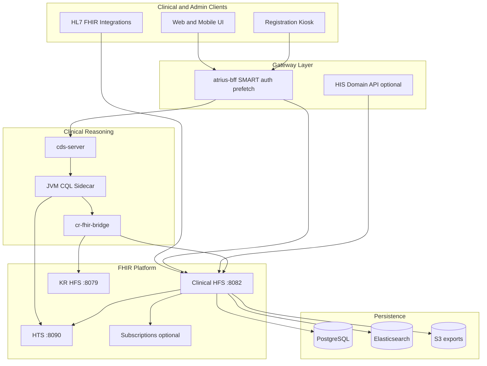
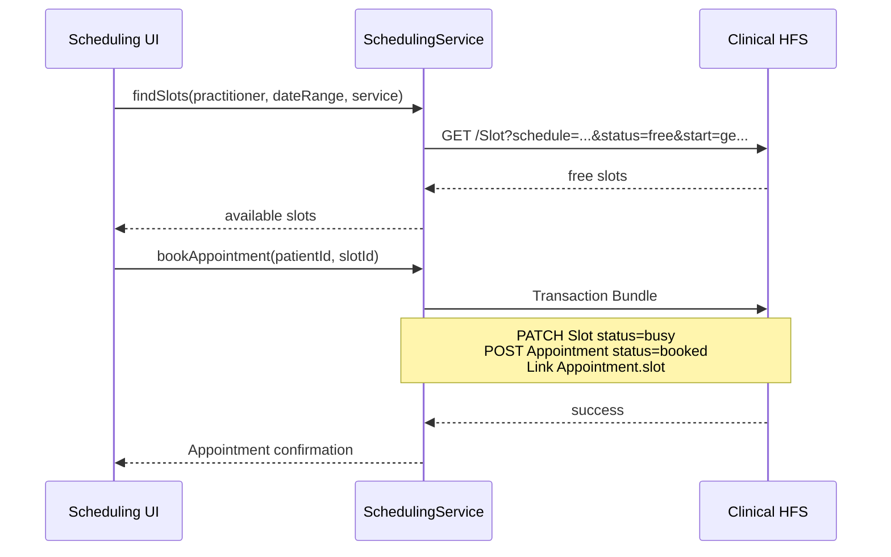
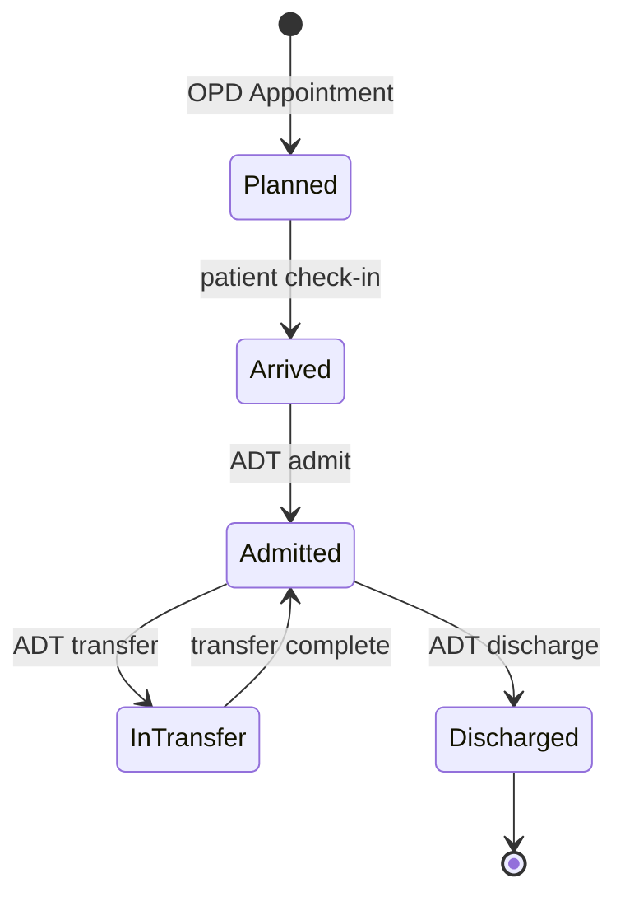
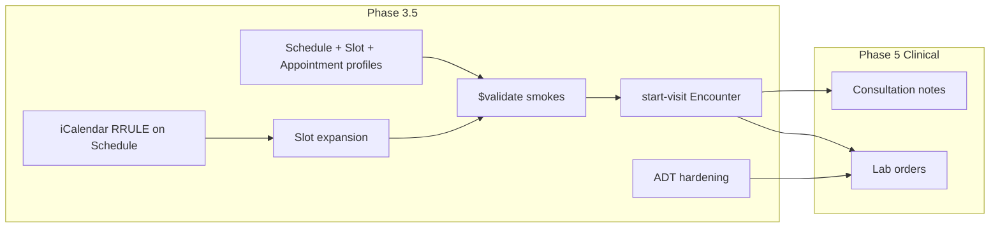

# FHIR-Native Hospital Information System — Comprehensive Plan

> **Status:** Living plan (updated 2026-06). Phases 0–3 have initial implementations in [`atrius-his`](../../../atrius-his); **Phase 3.5** (scheduling/ADT hardening + IG) is the active track before clinical documentation and orders.

## Executive summary

This repo already provides a **strong FHIR platform layer**: full R4 resource types ([`crates/fhir`](../../crates/fhir)), generic REST server ([`crates/rest`](../../crates/rest)), persistence with multi-tenancy ([`crates/persistence`](../../crates/persistence)), profile validation ([`crates/fhir-validator`](../../crates/fhir-validator) package layers), terminology ([`crates/hts`](../../crates/hts)), bulk export, optional subscriptions, and a clinical reasoning stack ([`docs/clinical-reasoning/README.md`](../clinical-reasoning/README.md)).

What it is **not yet**: a Hospital Information System. HFS stores and searches FHIR resources; it does not implement **operational semantics**—slot locking, appointment booking pipelines, ADT state machines, bed management, staff rostering, or order fulfillment workflows.

The path forward is **FHIR-native by design**: model hospital operations as standard (and Atrius-profiled) FHIR resources, enforce IGs at write time, drive workflows via **Task + PlanDefinition + Subscriptions**, and expose **domain services** (Rust microservices or a BFF) that orchestrate multi-resource transactions against HFS.



---

## What you have today (reuse, don't rebuild)

| Capability | Component | Hospital relevance |
|------------|-----------|-------------------|
| FHIR CRUD + search + history | HFS + helios-rest | All modules store data here |
| Multi-tenant isolation | `TenantContext` in persistence | Hospital groups, departments |
| Profile validation | `helios-fhir-validator` + `HFS_FHIR_PACKAGES` | Enforce Atrius/NDHM profiles on writes |
| Terminology | HTS | Code validation, `:in` search, CQL ValueSets |
| Batch/transaction bundles | HFS | Atomic multi-resource writes (register patient + encounter) |
| Bulk export | HFS `$export` | Analytics, reporting, data lake |
| Subscriptions (opt-in) | `helios-subscriptions` | ADT events, task assignment notifications |
| SMART auth (opt-in) | `helios-auth` + Keycloak | Role-based access in production |
| Clinical pathways | cds-server + sidecar + bridge | ED protocols, order sets, eCQM |
| Atrius profiles (57) | AtriusIGDraft + runtime-mapper | Encounter, ServiceRequest, Task, etc. |
| Audit trail | `helios-audit` | Compliance |

**Critical gaps for hospital ops** (must be built):

- No **Scheduling IG operations** (`$find`, `$book`, `$hold`) — only CRUD on Appointment/Schedule/Slot (domain services implement booking via transaction bundles today)
- **ADT workflow** — initial `AdtService` in atrius-his (admit/transfer/discharge/bed board); EpisodeOfCare and strict encounter validation still pending
- No **Task lifecycle operations** (`$accept`, `$start`, `$complete`) — Task is passive storage
- No **Appointment / Schedule / Slot / EpisodeOfCare Atrius profiles** yet — scheduling and ADT writes use base R4 resources without `meta.profile`
- No **MPI / patient match** (`$match`, `$everything`, merge)
- **HFS Location search** — `part-of` and `physical-type` not indexed; bed board uses client-side filter (platform fix deferred)
- **UI/BFF** for admin workflows lives mostly outside this repo ([`atrius-bff`](../clinical-reasoning/forward-plan.md), `atrius-clinical-ui`)

---

## Target architecture: three layers

### Layer 1 — FHIR Platform (existing, harden for production)

Single **Clinical HFS** instance per environment (PostgreSQL + Elasticsearch recommended for hospital scale):

```bash
HFS_STORAGE_BACKEND=postgres-elasticsearch
HFS_DATABASE_URL=postgresql://...
HFS_ELASTICSEARCH_NODES=http://...
HFS_AUTH_ENABLED=true
HFS_FHIR_PACKAGE_CACHE=/var/lib/hfs/fhir-packages
HFS_FHIR_PACKAGES=atrius.fhir.r4.india@0.1.0   # name@version from IG package.json
HFS_VALIDATION_MODE=enforce
HFS_TERMINOLOGY_SERVER=http://hts:8090
HFS_SUBSCRIPTIONS_ENABLED=true
```

Separate **KR HFS** for definitional artifacts (PlanDefinition, ActivityDefinition, Library, Measure) and **HTS** for terminology — same pattern as [clinical reasoning startup guide](../clinical-reasoning/startup-guide.md).

### Layer 2 — HIS Domain Services (new)

Thin orchestration services that encode **hospital business rules** and write FHIR bundles to HFS. Recommended as a new crate/binary in this repo or a sibling repo (`atrius-his` / extend `atrius-bff`):

| Service module | FHIR resources orchestrated | Key operations |
|----------------|----------------------------|----------------|
| **Registration** | Patient, RelatedPerson, Coverage, Consent | Register, update demographics, identifier assignment, `$match` dedup |
| **Scheduling** | Schedule, Slot, Appointment, HealthcareService | Find availability, book, cancel, reschedule, waitlist |
| **ADT** | Encounter, Location, EpisodeOfCare, Account | Admit, transfer, discharge, bed assignment |
| **Staffing** | Practitioner, PractitionerRole, Task, Basic (shift) | Duty roster, task assignment, handoff |
| **Orders** | ServiceRequest, MedicationRequest, Task | Order entry, fulfillment tracking (extends existing ActivityDefinition `$apply`) |

Each module exposes **REST APIs** (OpenAPI) that internally compose **FHIR transaction bundles** — keeping HFS as the system of record.

### Layer 3 — Client applications (external repos)

- **atrius-bff**: SMART auth, prefetch, session context — already exists for CDS
- **atrius-clinical-ui**: Clinician-facing UI — partial RequestGroup renderer exists
- **New admin UI**: Registration desk, scheduling board, bed management, staff roster — FHIR-native SPA consuming BFF + domain APIs

---

## Phase 0 — Foundation (weeks 1–4)

**Goal:** Production-grade platform all modules depend on.

### 0.1 Infrastructure baseline

- Deploy **PostgreSQL + Elasticsearch** (or postgres-only for pilot; ES improves chained search for scheduling)
- Enable **SMART auth** via Keycloak ([`docker/keycloak/`](../../docker/keycloak/))
- Map SMART scopes to hospital roles: `patient/*.read`, `patient/*.write`, `user/*.read`, compartment-aware access
- Enable **strict profile validation** with expanded Atrius manifest
- Enable **audit logging** (`HFS_AUDIT_*`)
- Define **tenant model**: one tenant per hospital, or org hierarchy via Organization + tenant routing

### 0.2 IG authoring in AtriusIGDraft (external)

Extend profiles for hospital operations not yet covered:

| Resource | New Atrius profile needs |
|----------|-------------------------|
| **Schedule** | Actor linkage (Practitioner / HealthcareService / Location), `planningHorizon`, service category/type, **iCalendar recurrence extension** (RRULE/TZID/EXDATE) |
| **Slot** | Schedule reference, start/end, status lifecycle, service type; must align with parent Schedule actors |
| **Appointment** | OPD/IPD visit types, status lifecycle, slot linkage, service type, participant roles |
| **EpisodeOfCare** | Care program enrollment (chronic disease, maternity); links inpatient Encounter chain |
| **Encounter** | ADT extensions: admission source, discharge disposition, bed/ward refs; OPD visit from Appointment |
| **Location** | Bed, ward, room, department hierarchy; occupancy via HL7 v2-0116 `operationalStatus` |
| **Task** | Nursing tasks, duty assignments, shift handoff; owner/period constraints |
| **Basic** | Shift roster, bed status board (common FHIR pattern for non-clinical admin) |
| **Composition** | Consultation note structure (Phase 5a) |

Publish IG package updates and seed them into `HFS_FHIR_PACKAGE_CACHE` (see `docs/validation-cutover.md`).

### 0.3 Terminology import

Follow [data-import.md](../clinical-reasoning/data-import.md):

- SNOMED CT, LOINC, ICD-10-CM, RxNorm via HTS import
- Hospital-specific ValueSets (departments, appointment types, admission types)
- Align `HFS_TERMINOLOGY_SERVER` and sidecar `htsBaseUrl`

### 0.4 Seed reference data

Transaction bundles to bootstrap a hospital:

- **Organization** (hospital, departments)
- **Location** (campus → building → ward → room → bed)
- **Practitioner** + **PractitionerRole** (consultants, nurses, admin)
- **HealthcareService** (OPD clinics, ED, radiology)
- **Schedule** + **Slot** templates (recurring availability)

Script pattern: extend [`scripts/import-synthea-atrius.py`](../../scripts/import-synthea-atrius.py) or create `scripts/seed-hospital-foundation.py`.

---

## Phase 1 — Patient Registration & MPI (weeks 5–8)

**Goal:** Register new patients with validated demographics and identifiers.

### FHIR resource model

```
Patient (atrius-patient profile)
  ├── identifier: MRN, Aadhaar/ABHA (NDHM), passport, insurance ID
  ├── name, telecom, address, birthDate, gender
  ├── contact (RelatedPerson)
  └── managingOrganization → Organization

Coverage (optional at registration)
Consent (data sharing, treatment)
```

### Domain service: `RegistrationService`

| Operation | Implementation |
|-----------|----------------|
| **Register patient** | Validate → create Patient (+ RelatedPerson) in transaction → return MRN |
| **Search / lookup** | Delegate to HFS `GET /Patient?name=...&identifier=...` |
| **Update demographics** | HFS PUT/PATCH with validation |
| **Duplicate check** | HFS search by identifier + fuzzy name/DOB; future: implement `$match` |
| **Merge** (later) | Patient merge operation — not in HFS today; design as domain service with provenance |

### Validation gates

- `HFS_VALIDATION_MODE=enforce` + `HFS_FHIR_PACKAGES` (Atrius IG) on Patient writes
- HTS `$validate-code` for identifier type codes, gender, marital status
- Business rules in domain service: required fields, age constraints, duplicate policy

### UI

- Registration desk form → BFF → RegistrationService → HFS
- Print/export: Composition or DocumentReference for registration summary (later)

### Integration point

- NDHM/ABHA verification (if India): external API in BFF; store ABHA as Patient.identifier

---

## Phase 2 — Scheduling & Appointments (weeks 9–14)

**Goal:** Book OPD/specialist appointments with slot management.

> **Implementation status (atrius-his):** `his-scheduling` + smoke tests pass (find slots, book, cancel, reschedule, 409 on double-book). Resources are **base R4** without Atrius profiles. Slot seeding uses a Python loop in `seed-hospital-foundation.py`. **Profile constraints, iCalendar recurrence, and `$validate` move to Phase 3.5.**

### FHIR resource model — the scheduling triad

Schedule, Slot, and Appointment are **one constraint chain** — profile and validate them together, not in isolation:

```
HealthcareService (clinic/specialty)
Schedule (actor = Practitioner | HealthcareService | Location)
  ├── planningHorizon (Period) — outer bounds of bookable time
  ├── serviceCategory / serviceType / specialty (optional filters)
  └── extension: atrius-schedule-recurrence (RRULE, TZID, EXDATE) — see Phase 3.5

Slot (status: free | busy | busy-unavailable | busy-tentative)
  ├── schedule → Schedule (required under profile)
  ├── start / end (instant)
  └── serviceCategory / serviceType (should match Schedule when present)

Appointment (status lifecycle: proposed → pending → booked → arrived → fulfilled | cancelled)
  ├── slot[] → Slot (booked appointments)
  ├── start / end (must match linked Slot)
  ├── participant[] (Patient, Practitioner, Location with status)
  └── serviceType / appointmentType (OPD follow-up, new visit, procedure)
```

**Design principle:** A bookable Slot must be provably consistent with its Schedule (actor, horizon, service). An Appointment must be provably consistent with its Slot (times, status, participants). IG cardinality and terminology bindings enforce this at write time once profiles land in Phase 3.5.

### Domain service: `SchedulingService`

HFS provides CRUD only — **you must implement booking semantics**:



| Operation | Rules |
|-----------|-------|
| **Find availability** | Query free Slots; filter by practitioner, location, service, date |
| **Book** | Atomic transaction: Slot→busy + Appointment→booked; reject if slot taken (optimistic lock via ETag/`If-Match`) |
| **Cancel** | Appointment→cancelled; Slot→free |
| **Reschedule** | Release old slot + book new in one transaction |
| **Waitlist** | Appointment with status=waitlist; Subscription on Slot freed |

### Optional: Scheduling IG `$find` / `$book`

Long-term, implement FHIR operations in a new handler ([`crates/rest/src/handlers/`](../../crates/rest/src/handlers/)) or expose via SchedulingService as `$find`/`$book` façade for interoperability.

### Subscriptions

Define SubscriptionTopic (R4 backport via Basic):

- `appointment-booked`, `appointment-cancelled`, `slot-freed`
- Notify SMS/email gateway (rest-hook channel exists in [`crates/subscriptions/`](../../crates/subscriptions/))

### Profiles (AtriusIGDraft)

Author **`atrius-in-schedule`**, **`atrius-in-slot`**, and **`atrius-in-appointment`** as a **single IG slice** (shared terminology bindings, invariants, examples). See **Phase 3.5** for iCalendar recurrence and implementation order.

---

## Phase 3 — ADT: Admit, Transfer, Discharge (weeks 15–20)

**Goal:** Manage inpatient stays, bed assignment, and encounter lifecycle.

> **Implementation status (atrius-his):** `his-adt` + smoke tests pass (admit, transfer, discharge, bed board, 409 on occupied bed). Encounters use **`atrius-in-encounter`** profile; beds use **`atrius-in-location`**. EpisodeOfCare, encounter `$validate` smoke, ADT subscriptions, and encounter-start CDS are deferred to Phase 3.5.

### FHIR resource model

```
EpisodeOfCare (inpatient program, optional)
Encounter (class=IMP, status=in-progress | finished)
  ├── subject → Patient
  ├── period (admit → discharge)
  ├── location[] (ward/bed with period and status)
  ├── hospitalization (admitSource, dischargeDisposition, reAdmission)
  └── appointment → originating OPD appointment (optional)

Location (physicalType=bd = bed; partOf = ward)
Account (billing account, optional Phase 6)
```

### Domain service: `AdtService`

| Operation | FHIR orchestration |
|-----------|-------------------|
| **Admit** | Create Encounter (class=inpatient, status=in-progress) + assign Location (bed) + update bed Location status extension + optional EpisodeOfCare |
| **Transfer** | End current Encounter.location period + add new location + update bed statuses |
| **Discharge** | Encounter.status=finished, period.end=now, bed→available, EpisodeOfCare status if applicable |
| **Bed board query** | Search Location (wards) + Encounter?location= + status |



### CDS integration at admission

Wire existing **encounter-start** hook ([ER chest pain pathway](../clinical-reasoning/README.md)):

1. ADT admit creates Encounter
2. UI fires CDS Hooks `encounter-start` with prefetch
3. cds-server → sidecar PlanDefinition/$apply → RequestGroup (clinical orders)
4. Clinician accepts → ServiceRequests written to HFS

This connects **operational ADT** to your existing **clinical reasoning** stack.

### Subscriptions for ADT

Topics: `encounter-admitted`, `encounter-transferred`, `encounter-discharged` — feed bed management board, housekeeping, billing triggers.

---

## Phase 3.5 — Scheduling & ADT hardening (weeks 21–24)

**Goal:** Close the gap between “working smoke tests” and **production-ready operational + clinical entry points**. Do **not** start consultation notes or lab orders until this phase completes — they depend on validated encounters linked to appointments.

This phase deliberately **tightens Phases 2 and 3** before Phase 4 (staffing) or Phase 5 (clinical documentation and orders).

### Why Schedule + Slot + Appointment together

Appointment booking is a **three-resource invariant**:

| Resource | Role in booking |
|----------|-----------------|
| **Schedule** | Defines *who/what/when* availability exists (actor, horizon, recurrence) |
| **Slot** | Materialized bookable window; status transitions on book/cancel |
| **Appointment** | Committed booking; references Slot; drives check-in and OPD Encounter |

Profiling only Appointment leaves Slot and Schedule unconstrained — bad writes (orphan slots, actor mismatch, times out of horizon) slip through until book time. **Ship all three profiles in one IG PR** with shared ValueSets (appointment type, service category) and worked examples (OPD follow-up, new patient visit).

### iCalendar / recurrence on Schedule

**Recommendation: yes — constrain Schedule with iCalendar semantics**, but be precise about what FHIR R4 gives you:

| Mechanism | Use |
|-----------|-----|
| **`Schedule.planningHorizon`** | Outer Period (start/end) — nothing bookable outside this |
| **Atrius extension `atrius-schedule-recurrence`** | RFC 5545 `RRULE`, `TZID`, optional `EXDATE` / `RDATE` on Schedule |
| **`Slot` materialization** | Expand recurrence into concrete Slots (what seed script does manually today) |
| **Optional later** | `$find`-style façade; import/export full `.ics` for practitioner personal calendars |

R4 **Schedule has no native RRULE element** (R6 adds richer Appointment recurrence). Hospital systems still think in weekly clinic hours — storing RRULE on Schedule is the right interoperability anchor. **`his-scheduling` owns expansion**: given Schedule + horizon, generate or refresh free Slots idempotently (PUT by deterministic slot id, e.g. `{scheduleId}-{start}`).

**Do not block Phase 3.5 on full bi-directional iCal sync** (Google Calendar, Outlook). Start with:

1. Author recurrence extension + profile constraints on Schedule
2. Implement `expandScheduleRecurrence(schedule, from, to)` in `his-domain`
3. Replace ad-hoc Python slot loop in `seed-hospital-foundation.py` with expansion API or shared Rust library
4. Validate expanded Slots against `atrius-in-slot` before write

### Phase 3.5 work breakdown

#### 3.5.1 IG authoring (AtriusIGDraft)

| Profile | Key constraints |
|---------|-----------------|
| **`atrius-in-schedule`** | `actor` (1+), `active`, `planningHorizon`, optional recurrence extension, serviceCategory/type |
| **`atrius-in-slot`** | `schedule` (required), `status`, `start`, `end`; start/end within parent Schedule.planningHorizon |
| **`atrius-in-appointment`** | `status`, `slot` or explicit start/end, `participant` (Patient + Practitioner minimum), serviceType/appointmentType |

Also:

- ValueSets: appointment-type, visit-mode (in-person/tele), OPD service types
- Examples: Schedule with RRULE `FREQ=WEEKLY;BYDAY=MO,TU,WE,TH,FR`, Slots, booked Appointment
- Seed `HFS_FHIR_PACKAGE_CACHE` via `setup-atrius-profile-registry.sh`; set `HFS_FHIR_PACKAGES` + `HFS_VALIDATION_MODE=enforce`

#### 3.5.2 Domain layer (atrius-his)

| Task | Crate / area |
|------|----------------|
| Add `meta.profile` to Schedule/Slot/Appointment builders | `his-domain/scheduling.rs` |
| Recurrence expansion + slot id strategy | `his-domain` (new `schedule_recurrence` module) |
| `POST /schedules/{id}/expand-slots?from=&to=` (or internal only at first) | `his-scheduling` / `his-server` |
| `$validate` in smoke tests for all three resources | `scripts/smoke-scheduling.sh` |
| **OPD Encounter from Appointment** — `POST /encounters/start-visit` (AMB class, links `appointment`, patient, practitioner) | `his-adt` or new `his-encounter` helper |
| Check-in status transition: Appointment `booked` → `arrived` → `fulfilled` | `his-scheduling` |
| EpisodeOfCare on inpatient admit (optional link to originating Appointment) | `his-adt` |
| ADT `$validate` smoke; bed board patient display name | `his-adt`, smoke scripts |
| HFS indexing for `Location.part-of`, `Location.physical-type` (or document as platform backlog) | atrius-hfs persistence |

#### 3.5.3 Subscriptions & CDS (optional in 3.5, required before UI)

- Topics: `appointment-booked`, `appointment-cancelled`, `encounter-started`, `encounter-admitted`, `encounter-discharged`
- Wire **encounter-start** CDS hook on OPD visit start and IP admit (existing chest-pain pathway as reference)

### Phase 3.5 success criteria

| Demo | Pass |
|------|------|
| Schedule with RRULE loads; expansion creates profile-valid Slots for 14 days | ✓ |
| Book Appointment → `$validate` clean on Schedule, Slot, Appointment | ✓ |
| Cancel / reschedule still pass smoke with profiled resources | ✓ |
| `start-visit` from booked Appointment → AMB Encounter with `appointment` link | ✓ |
| Admit / transfer / discharge still pass; Encounter `$validate` clean | ✓ |
| Bed board shows patient name; vacant after discharge | ✓ |



---

## Phase 4 — Staff Rostering & Duty Assignment (weeks 25–30)

**Goal:** Assign staff duties, nursing tasks, and shift handoffs.

### FHIR resource model

```
Practitioner (existing atrius-practitioner)
PractitionerRole (role, specialty, organization, location, availability)
Task (status: requested → accepted → in-progress → completed)
  ├── owner → Practitioner / PractitionerRole
  ├── for → Patient (optional)
  ├── focus → Encounter | ServiceRequest
  ├── authoredOn, executionPeriod
  └── code (task type: medication administration, vitals, handoff)

Basic (optional: shift roster resource)
  ├── code = shift-roster
  ├── subject → Organization | Location
  └── extension: practitioner, role, period, shift-type
```

### Domain service: `StaffingService`

| Operation | Implementation |
|-----------|----------------|
| **Create duty roster** | Batch create Tasks or Basic resources for a shift period |
| **Assign task** | Task.owner = Practitioner; status=requested |
| **Accept / start / complete** | Task status transitions with audit |
| **Handoff** | Close in-progress Tasks for outgoing shift; create new Tasks for incoming |
| **Who is on duty?** | Query PractitionerRole + Basic shift roster + Task?owner=...&status=in-progress |

### Authorization

SMART scopes tied to PractitionerRole:

- Nurses: `Task?owner=:me` write, Patient compartment read
- Ward manager: Task write for location compartment
- Admin: PractitionerRole CRUD

### UI

- Ward task list (Kanban by status)
- Shift roster calendar
- Handoff checklist (Task bundle template)

---

## Phase 5 — Clinical documentation & orders (weeks 31–38)

**Goal:** OPD and inpatient clinical workflows on top of **validated Encounters** from Phase 3.5. Split into documentation and ordering tracks — both can progress in parallel once `start-visit` exists.

### Phase 5a — Consultation notes (documentation)

**Entry point:** OPD — book → check-in → `start-visit` → write note.

| Resource | Pattern |
|----------|---------|
| **Composition** (preferred) or **DocumentReference** | Consult note sections: chief complaint, HPI, exam, assessment, plan |
| **Encounter** | `status=in-progress` during visit; `finished` at checkout |
| **Provenance** | Author Practitioner; signed/finalized status |
| **Profile** | `atrius-in-composition` (author in AtriusIGDraft) |

**Domain service:** `DocumentationService` (or extend `his-adt` initially)

| Operation | FHIR orchestration |
|-----------|-------------------|
| **Create draft note** | POST Composition (status=preliminary) linked to Encounter |
| **Update / amend** | PUT with version; retain history |
| **Sign / finalize** | Composition.status=final + attester |
| **Read by encounter** | `GET /Composition?encounter=` |

**Smoke:** book appointment → start-visit → create note → finalize → read back.

### Phase 5b — Lab orders & CPOE

**Entry point:** OPD or IP — Encounter must exist.

| Resource | Pattern |
|----------|---------|
| **ServiceRequest** | category=laboratory (LOINC-coded tests); `encounter`, `subject`, `requester` |
| **Task** | Fulfillment tracking (lab collect, process, result) |
| **DiagnosticReport** + **Observation** | Results (Phase 6 LIS integration) |

**Domain service:** `OrderService`

| Operation | FHIR orchestration |
|-----------|-------------------|
| **Place lab order** | POST ServiceRequest (+ optional Task) in transaction |
| **Order set / pathway** | Reuse PlanDefinition `$apply` via cds-server + bridge (existing stack) |
| **Discontinue** | ServiceRequest.status=revoked |
| **List by encounter** | Search ServiceRequest?encounter= |

**CDS Hooks:** `order-select`, `order-sign` for duplicate therapy, interaction checks ([`helios-cds-hooks`](../../crates/cds-hooks/)).

**Smoke:** `./scripts/smoke-lab-orders.sh` — book → start-visit → place CBC order → `$validate` ServiceRequest → revoke.

**Deferred:** Task fulfillment, CDS Hooks, PlanDefinition `$apply` bridge, Phase 6 LIS results.

### Phase 5 sequencing recommendation

| Order | Track | Rationale |
|-------|-------|-----------|
| 1 | **5a Consultation notes** on OPD | Fast clinician-visible win; minimal external integration |
| 2 | **5c Discharge summary + DocumentBundle export** on IP | NDHM-aligned inpatient artifact; reuses clinical module |
| 3 | **5b Lab orders** (write path only) | ServiceRequest + Task; stub results |
| 4 | Phase 6 LIS | DiagnosticReport inbound |

### Phase 5c — NDHM record parity (documentation)

**Architecture:** See [`clinical-documentation-architecture.md`](clinical-documentation-architecture.md).

| Deliverable | Status |
|-------------|--------|
| Shared `his-domain/clinical/` module (lifecycle, entry builders, transaction, specs) | ✓ |
| OP consult extended slices (Allergies, Investigations, Medications, Referral) | ✓ |
| Discharge summary builder + `/discharge-summaries` API | ✓ |
| DocumentBundle export (`POST .../export`) | ✓ |
| IG entry slicing (Prescription, Immunization, Invoice, DiagnosticReport lab) | ✓ |
| Prescription / Wellness / Immunization / Invoice record builders + APIs | ✓ |
| Inpatient progress/procedure note section profiles + builders + APIs | ✓ |
| Health document record (Pattern D) | Pending |

**Smoke:** `./scripts/smoke-discharge-summary.sh`; `./scripts/smoke-clinical-documents.sh` (all Phase 5c/5d kinds).

### Phase 5d — Inpatient & procedural notes ✓

| Deliverable | Status |
|-------------|--------|
| Progress note + procedure note builders + APIs | ✓ |
| Operative note + anesthesia record IG profiles + builders + APIs | ✓ |
| `AtriusInInvoice` + `AtriusInInvoiceRecord` IG profiles | ✓ |
| ED note variant | Pending (Phase 5e) |

**Smoke:** `./scripts/smoke-clinical-documents.sh` (IP path: progress, procedure, operative, anesthesia).

---

## Phase 5 (legacy summary) — Orders, CPOE & Care Coordination

> **Superseded by Phase 5a/5b above** — retained for reference to existing clinical reasoning integration.

### Leverage existing stack

| Existing | Extend for hospital |
|----------|---------------------|
| ActivityDefinition catalog | Standard order sets (labs, imaging, meds) |
| PlanDefinition `$apply` via bridge | Pathway-driven order bundles at encounter-start |
| ServiceRequest / MedicationRequest | CPOE writes to HFS |
| Task | Fulfillment tracking (pharmacy, lab, nursing) |

### Domain service: `OrderService`

- **Place order**: Create ServiceRequest/MedicationRequest + fulfillment Task
- **Discontinue / modify**: Status transitions + supersede pattern
- **Results**: Observation/DiagnosticReport linked to ServiceRequest (lab/RIS integration)

### CDS Hooks at order time

Enable `order-select`, `order-sign` hooks (already typed in [`helios-cds-hooks`](../../crates/cds-hooks/)) for medication interaction checks, duplicate therapy alerts.

---

## Phase 6 — Integration, Analytics & Hardening (ongoing)

### External system integration (FHIR-native)

| System | Pattern |
|--------|---------|
| Lab (LIS) | ServiceRequest → Subscription → lab system; DiagnosticReport back |
| Radiology (RIS/PACS) | Same with ImagingStudy, DiagnosticReport |
| Pharmacy | MedicationRequest → MedicationDispense |
| Insurance | Coverage, Claim, EligibilityRequest (FHIR R4 resources exist in helios-fhir) |
| Legacy HL7v2 | FHIR converter (e.g. HAPI HL7v2-FHIR) → HFS transaction bundles |

### Analytics

- **Bulk `$export`** for population health, billing extracts
- **SQL-on-FHIR** ([`helios-sof`](../../crates/sof/)) for ad-hoc reporting ViewDefinitions
- **eCQM**: existing 67 CMS services on `patient-view`; expand runtime-mapper for Encounter/Observation ([Phase D in forward-plan](../clinical-reasoning/forward-plan.md))

### Non-functional requirements

| Concern | Approach |
|---------|----------|
| **Availability** | HA PostgreSQL, multiple HFS instances (shared DB), ES cluster |
| **Performance** | ES for search; connection pooling; `$export` for bulk reads |
| **Security** | SMART auth mandatory; tenant isolation; audit trail; break-glass AuditEvent |
| **Compliance** | Consent resources; provenance on merges; retention policies |
| **Testing** | Integration tests per domain service; Inferno FHIR validator; scheduling/ADT scenario tests |

---

## Recommended repository structure (new work)

```
atrius-hfs/                          # Layer 1 — FHIR platform
  crates/fhir-validator/             # Single engine; Atrius IG via HFS_FHIR_PACKAGES
  scripts/setup-atrius-profile-registry.sh
  docs/his/                          # This plan

atrius-his/                          # Layer 2 — domain services (active implementation)
  crates/
    his-domain/                      # FHIR client, builders (patient, scheduling, adt)
    his-registration/                # RegistrationService ✓
    his-scheduling/                  # SchedulingService ✓ — profiles + iCal in 3.5
    his-adt/                         # AdtService ✓ — EpisodeOfCare + start-visit in 3.5
    his-documentation/               # DocumentationService ✓ (5a, 5c, 5d)
    his-orders/                      # NEW Phase 5b (or his-cpoe)
    his-staffing/                    # Phase 4
    his-server/                      # Unified API ✓
  scripts/
    seed-hospital-foundation.py      # Foundation + slots (→ recurrence expansion in 3.5)
    smoke-registration.sh            # ✓
    smoke-scheduling.sh              # ✓ — add $validate in 3.5
    smoke-adt.sh                     # ✓
    smoke-start-visit.sh             # ✓ Phase 3.5
    smoke-consult-note.sh            # ✓ Phase 5a
    smoke-discharge-summary.sh       # ✓ Phase 5c
    smoke-clinical-documents.sh      # ✓ Phase 5c/5d (8 document kinds)
    smoke-lab-orders.sh              # ✓ Phase 5b (LOINC ServiceRequest CPOE)

AtriusIGDraft/                       # Profiles: schedule, slot, appointment, composition
atrius-bff/                          # SMART auth, API aggregation, HIS proxy
atrius-admin-ui/                     # Front desk SPA (register / book / start-visit)
atrius-clinical-ui/                  # Clinician UI (separate workspace)
```

Alternative: keep domain services entirely in **`atrius-bff`** if you prefer a single API gateway — the FHIR bundle orchestration logic still belongs in a dedicated module either way.

---

## FHIR resource map by hospital function

| Hospital function | Primary resources | Domain service | HFS-only sufficient? |
|-------------------|-------------------|----------------|----------------------|
| Register patient | Patient, RelatedPerson, Coverage | Registration | No — needs MPI rules |
| Book appointment | Schedule, Slot, Appointment | Scheduling | No — needs atomic booking |
| Check in / start OPD visit | Appointment → Encounter (AMB) | Scheduling + ADT (Phase 3.5) | No — needs start-visit |
| Write consultation note | Composition, Encounter | Documentation (5a) | No |
| Admit inpatient | Encounter, Location, EpisodeOfCare | ADT | No |
| Transfer bed | Encounter.location, Location | ADT | No |
| Discharge | Encounter, Location, Account | ADT | No |
| Assign nurse duty | Task, PractitionerRole | Staffing | No — needs task lifecycle |
| Shift roster | Basic, PractitionerRole | Staffing | No |
| Place lab order | ServiceRequest, Task | Orders + CDS | Partial — `$apply` exists |
| Clinical pathway | PlanDefinition, CarePlan, RequestGroup | cds-server + bridge | Yes (existing) |
| Quality measure | Measure, Library | cds-server | Yes (existing) |

---

## Decision points (defaults assumed)

| Decision | Recommended default | Alternative |
|----------|--------------------|-------------|
| Deployment | Greenfield single hospital pilot | Multi-tenant network from Phase 0 |
| Phase 1 priority | Registration → Scheduling → ADT | ED-first using existing chest pain pathway |
| UI strategy | Extend atrius-bff + new admin UI | API-only for integration-first |
| Regulatory profiles | Atrius-core + NDHM identifiers | US Core / IPS for international |
| Workflow engine | Task + PlanDefinition + Subscriptions (FHIR-native) | External BPM (Camunda) — avoid unless required |
| Scheduling operations | Domain service + transaction bundles; RRULE slot expansion (Phase 3.5) | Implement Scheduling IG `$find`/`$book` in helios-rest |
| Scheduling profiles | **Schedule + Slot + Appointment as one IG slice** with iCalendar RRULE on Schedule | Appointment-only profile (insufficient constraints) |
| Clinical entry | **Phase 3.5 before Phase 5** — start-visit + validated profiles | Jump directly to notes/orders on raw CRUD |

---

## Success criteria by phase

| Phase | Demo scenario | Status |
|-------|---------------|--------|
| 0 | Hospital foundation data loaded; strict validation rejects bad Patient | ✓ atrius-his |
| 1 | Register patient with MRN; search and retrieve; duplicate warning | ✓ smoke |
| 2 | Book OPD appointment; cancel; reschedule; 409 on double-book | ✓ smoke (base R4) |
| 3 | Admit patient to bed; transfer ward; discharge; bed board updates | ✓ smoke |
| **3.5** | **Profiled Schedule/Slot/Appointment; RRULE expansion; `$validate`; start-visit Encounter** | **Next** |
| 4 | Assign nursing tasks to shift; nurse accepts/completes; handoff | Pending |
| 5a | Book → start-visit → consultation note → finalize → `$validate` | ✓ smoke |
| 5c | Admit → discharge summary → finalize → `$validate` → DocumentBundle export | ✓ smoke |
| 5d | OPD + IP clinical documents (8 kinds) → finalize → `$validate` → export | ✓ smoke |
| 5b | Place lab order on Encounter → `$validate` → revoke | ✓ smoke (Task deferred) |
| 6 | Bulk export all Encounters; SOF view for daily census; LIS results | Pending |

---

## Immediate next steps (Phase 3.5 — first 2–3 weeks)

1. **AtriusIGDraft:** Author **`atrius-in-schedule`**, **`atrius-in-slot`**, **`atrius-in-appointment`** + **`atrius-schedule-recurrence`** extension (RRULE/TZID/EXDATE); examples and ValueSets
2. **Packages:** Re-seed `data/fhir-packages` from the published IG; confirm `$validate` in `enforce` mode passes on examples
3. **his-domain:** Profile constants + builders for Schedule/Slot/Appointment; recurrence expansion module
4. **his-scheduling:** Apply profiles on write; `expand-slots`; extend smoke with `$validate`
5. **his-adt:** `POST /encounters/start-visit` from Appointment; EpisodeOfCare on admit; ADT validate smoke
6. **Seed:** Replace Python slot loop with recurrence-driven expansion from profiled Schedule
7. **Smoke:** `smoke-start-visit.sh` — register → book → start-visit → read Encounter

**After Phase 3.5:** Phase 5a (consultation notes) before Phase 5b (lab orders) for fastest OPD clinician demo; Phase 4 (staffing) when nursing task assignment is needed for order fulfillment.

This plan keeps HFS as the **authoritative FHIR store**, uses your **validation and terminology** stack for data quality, connects **clinical reasoning** at encounter boundaries, and adds **thin domain services** for the operational semantics a hospital needs — staying FHIR-native throughout.
