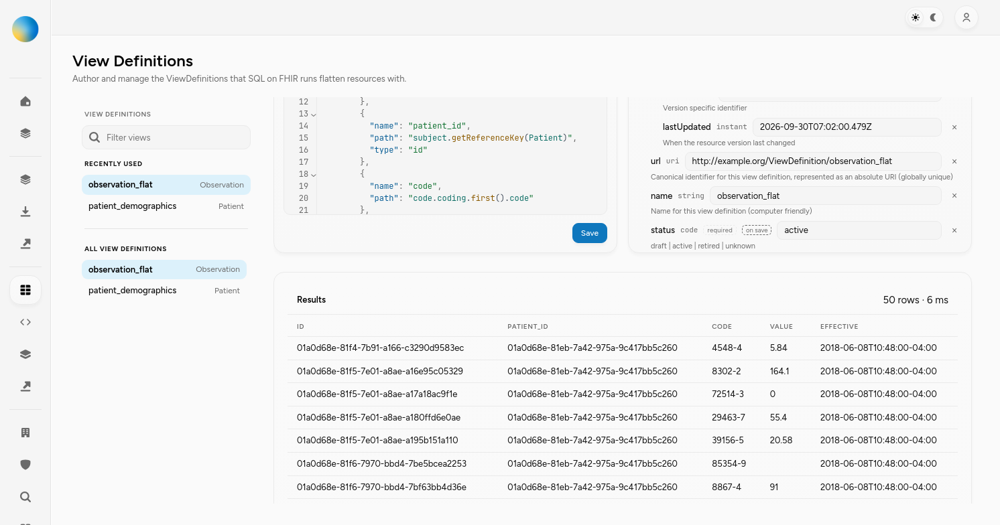

# SQL-on-FHIR preview limits: PostgreSQL evidence for #1581

The flat `observation_flat` preview from [#1581](https://github.com/HeliosSoftware/hfs/issues/1581)
now exposes its 50-row cap to PostgreSQL. The captured query returns 50 rows from
51 index input rows instead of running an unlimited projection over 7,699,987
Observations. [PR #1609](https://github.com/HeliosSoftware/hfs/pull/1609) also caps
SQLite SQL output. PostgreSQL expansions, unions and recursion retain their
previous SQL and client cap because adding a SQL cap changed observed prefixes.

These files preserve evidence captured on 2026-09-30. Publishing the files did
not rerun the benchmark. The measured compiler and runner source hashes match
the PR implementation at `5f48f35374afe72f3d54195b3b5f50092c56fc2f`, before
the subsequent merge of `main`. That merge also brings upstream tracing, SQLite
NULL-column preservation and REST `_since` fixes; these are not new full-corpus
performance measurements of the merged branch. Binary/source hashes and artifact checksums are recorded in
[measurement-provenance.json](evidence/1581/measurement-provenance.json).

## Full-corpus preview measurements

The release R4/PostgreSQL/UI build used a verified physical clone of the test
database, with 7,699,987 Observations, 11,705 Patients and 18,956,544 resources.
The source database was not modified. The baseline was commit
`4427ae16c5dda7338e43032ac49d7c4e79b9875f`; the candidate contains the preview
limit implementation now in #1609. Rust was 1.98.1; PostgreSQL was 16.15,
schema version 44, with 14 CPUs and 18 GB RAM allocated to the clone.

Settings were `shared_buffers=4GB`, `effective_cache_size=14GB`,
`maintenance_work_mem=768MB`, `work_mem=16MB`, `max_wal_size=12GB`,
`checkpoint_timeout=30min`, `wal_compression=pglz`, `autovacuum=off`.
HFS used 24 pool connections, a 600-second statement/request timeout, and a
60-second pool wait timeout. Clone indexes and statistics were not changed.

Cold measurements stopped only the cloned PostgreSQL instance, evicted only
its database file cache, verified zero residency with `mincore`, and restarted
it. The HFS process stayed alive. No global cache flush was used. Warm runs
followed an equivalent completed request; successful preview measurements ran
without concurrent builds, tests or EXPLAIN statements.

| Preview | Baseline cold / warm card time | Candidate cold / warm card time | Returned rows |
| --- | ---: | ---: | ---: |
| observation_flat | 117 / 62 ms | 6 / 2 ms | 50 |
| patient_demographics | 1,118 / 232 ms | 10 / 3 ms | 50 |

The Results card's duration is the issue's requested metric. HTTP time and
action-to-fresh-DOM time are recorded separately in the provenance JSON.
The historical 11–15-second card timing was **not reproduced** on this baseline;
these measurements establish the current behavior on the same data volume,
not a before/after reproduction of that historical latency. They are individual
controlled samples, not percentile measurements or a guarantee for every view.

| Baseline cold Observation preview | Candidate cold Observation preview |
| --- | --- |
|  |  |

The PNG files are original downloaded copies of the synthetic-data screenshots
previously linked from the PR. They do not depend on the temporary hosting URLs.

## SQL and complete execution plans

Both SQL files use bindings `default` and `Observation`. The candidate appends
`LIMIT 50` after the existing `ORDER BY r.last_updated, r.id`, with the client
cap still present as a safety net. Filtering therefore precedes the cap.

- [Executed baseline SQL](evidence/1581/before-runtime.sql),
  [complete baseline EXPLAIN JSON](evidence/1581/before-explain.json), and
  [baseline text plan](evidence/1581/before-explain.txt).
- [Executed candidate SQL](evidence/1581/after-runtime.sql) and
  [complete candidate EXPLAIN JSON](evidence/1581/after-explain.json).

The plans use `EXPLAIN (ANALYZE, BUFFERS, FORMAT JSON)` and the HFS pool's
`force_custom_plan` setting. They are separate from the cold UI measurements.

| Executed plan | Root output rows | Index input rows | Execution time |
| --- | ---: | ---: | ---: |
| Baseline, unlimited | 7,699,987 | 7,699,987 | 28,819.810 ms |
| Candidate, `LIMIT 50` | 50 | 51 | 2.657 ms |

Both plans use `idx_resources_search` and incremental sorting on
`last_updated, id`; the index supplies the presorted `last_updated` key. The
limit permits the candidate to stop early. No new index was needed for this
captured flat view. The baseline EXPLAIN consumes the entire unlimited query,
while the baseline UI stops accepting rows at its client cap, so its plan time
must not be compared directly with the card time.

## Why the PostgreSQL complex-view fallback remains

PostgreSQL needs a unique ordering for a predictable limited subset, and
`LIMIT` can affect the execution plan. See the PostgreSQL 16 documentation on
[LIMIT/OFFSET](https://www.postgresql.org/docs/16/queries-limit.html) and
[EXPLAIN](https://www.postgresql.org/docs/16/using-explain.html).
The current expansion SQL orders by the resource's timestamp and ID, leaving
rows from one resource tied; unions and recursion use `ORDER BY 1`, which also
permits ties. Adding a cap can change which tied rows appear in the first 50.

An isolated synthetic fixture has:

- `p-large`: 150 names, `Family-1` through `Family-150`, with two given names
  per name, `use=official` for the first 75 and `temp` for the rest, plus ten
  addresses;
- `p-empty`: no names;
- `p-filtered`: one name with family `Rejected` and `use=temp`.

Its ViewDefinition selects only `family` using `forEachOrNull: name`, without
projecting ID or adding a filter. It produces 152 rows. In both the initial and
post-ANALYZE probes, unlimited results started `Family-1, Family-2, Family-3`;
direct `LIMIT 50` started `Family-2, Family-3, Family-4`, with `Family-1` at
position 50. Counts alone would miss this change. The exact SQL, full sequences
and complete plans are preserved here:

- [Unlimited SQL](evidence/1581/nullable-unlimited.sql),
  [direct-limit SQL](evidence/1581/nullable-direct-limit.sql), and
  [materialized-limit SQL](evidence/1581/nullable-materialized-limit.sql).
- [Results for both probe conditions](evidence/1581/nullable-prefix-results.json).
- Initial plans: [unlimited](evidence/1581/nullable-initial-unlimited-plan.json),
  [direct](evidence/1581/nullable-initial-direct-limit-plan.json),
  [materialized](evidence/1581/nullable-initial-materialized-limit-plan.json).
- Post-ANALYZE plans: [unlimited](evidence/1581/nullable-analyzed-unlimited-plan.json),
  [direct](evidence/1581/nullable-analyzed-direct-limit-plan.json),
  [materialized](evidence/1581/nullable-analyzed-materialized-limit-plan.json).

The materialized wrapper preserved the prefix in these isolated probes. A
prior complete candidate suite nevertheless recorded a nullable prefix failure
starting `Family-150, Family-148, Family-149`. Its exact physical cause was not
established, and that historical suite log is not among these retained files.
The successful isolated plans do not establish a universal materialization
guarantee. Materializing the whole query would also retain the unbounded work.

The project decision for this PR is to preserve the existing complex-view SQL
and client cap rather than introduce a change to tie ordering. This solves the
reported flat Observation preview and preserves unlimited exports. It does
**not** satisfy the original unconditional SQL-limit criterion for every
PostgreSQL ViewDefinition. Deterministic ordering and SQL pushdown for complex
views are tracked in [#1623](https://github.com/HeliosSoftware/hfs/issues/1623);
this is a current scope decision, not
evidence that the original checklist was universally fulfilled.

## Regression coverage and remaining work

The existing runner tests observe actual SQL, compare ordered prefixes, cover
`where`, expansions, unions, nullable collections, repeat, constants, tenant
isolation and runtime filters. PostgreSQL complex tests explicitly require the
unchanged unlimited SQL. SQLite tests independently exercise its output cap.
REST export and SQLQuery tests preserve all 80 fixture rows without truncating
dependencies to the preview cap.

The original captured verification reports 194 focused tests and the release
build passing. The PR's later remote Rust, lint, security, coverage and
`codecov/patch` checks passed on the pre-merge PR. Publishing this evidence does
not change the limit implementation. Artifact integrity, historical source
fingerprints, JSON structure, relative links and recorded plan/measurement
invariants were checked again. The subsequent merge is verified separately;
the historical test totals and measurements above do not describe new performance
runs. The merged branch separately passed 113 focused debug tests: 56 SOF units,
20 PostgreSQL runner tests, 33 SQLite runner tests, two REST NULL-column tests and
two REST `_since` tests. Per-crate formatting and `git diff --check` passed. These
checks verify the integrated behavior; they do not rerun the full-corpus timings.

[The follow-up](https://github.com/HeliosSoftware/hfs/issues/1623) must define tie ordering for nested/cartesian/nullable expansion,
union branch ties and recursive traversal before applying a cap universally.
It must preserve visible columns, row counts, filters and FHIRPath `%rowIndex`
semantics, disclose any change to unlimited/export order, test both SQL
dialects, and measure whether the chosen ordering actually reduces server work.
