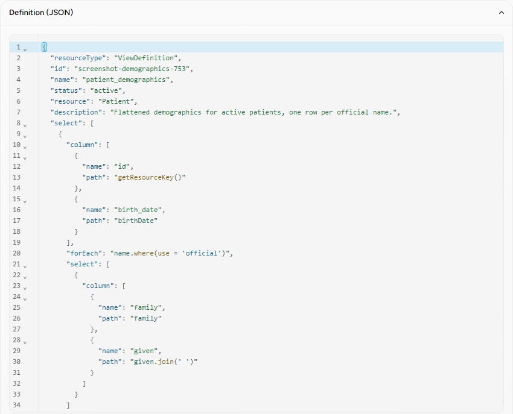
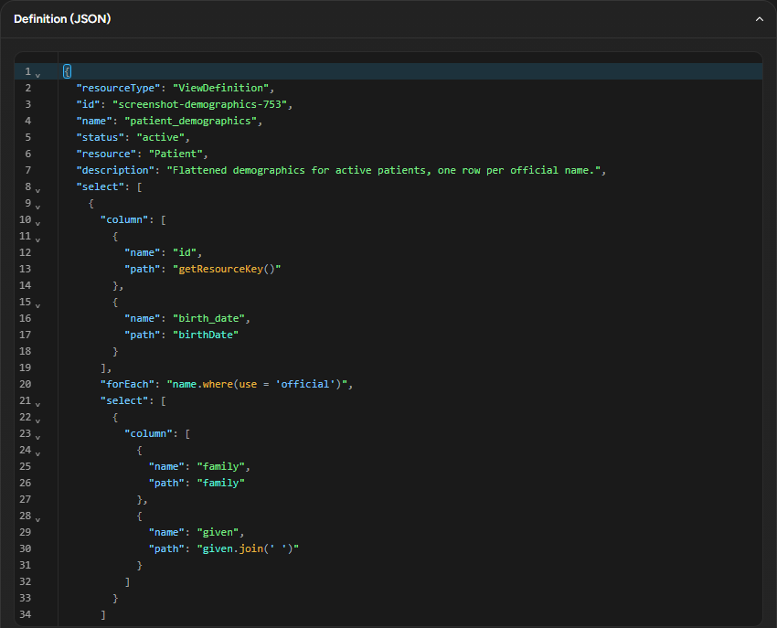
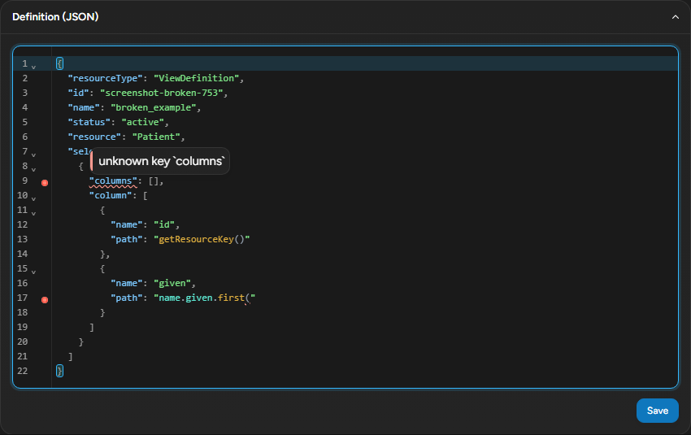

# ViewDefinition editor: a richer editing surface (decision record)

**Status:** Implemented — the seed landed as
[#820](https://github.com/HeliosSoftware/hfs/pull/820) (`feat/753-vd-editor-evaluation`),
ready for review; the follow-up implementation issue (completion, test coverage, i18n,
generalization — §9) is Blocked by it. See
[#753](https://github.com/HeliosSoftware/hfs/issues/753) for the original request and the
comment this doc's findings are summarized into.
**Scope:** the JSON editor for a ViewDefinition on `/ui/sql/view-definitions`
(`crates/ui/templates/pages/sql-view-definitions.html`) — highlighting, completion, and
diagnostics for a document that is itself two nested languages.

## 1. Problem

`/ui/sql/view-definitions` edits a ViewDefinition in a plain
`<textarea class="json-editor" name="json">`. It has no syntax highlighting, no completion,
and no error feedback until the user clicks Run and reads whatever `$sql-run` returns —
usually the *first* problem in the document, as a flattened string, with no indication of
where in a possibly hundred-line document it came from.

A ViewDefinition is a language inside a language. The **outer** layer is JSON with a specific
shape: which keys are legal on which node, which are required, what type each one holds — the
shape `helios-fhir`'s generated `r4::ViewDefinition` / `ViewDefinitionSelect` /
`ViewDefinitionSelectColumn` / `ViewDefinitionSelectColumnTag` / `ViewDefinitionWhere` /
`ViewDefinitionConstant` structs already encode as Rust types. The **inner** layer is
[FHIRPath](http://hl7.org/fhirpath/), living inside specific string values — `column[].path`,
`where[].path`, `forEach`, `forEachOrNull`, each element of `repeat` — and nowhere else; a
`ViewDefinition.name` or `.description` string is never FHIRPath.

Three things are worth wanting for each layer: **highlighting** (so the two languages read as
visually distinct), **completion** (so the legal vocabulary is discoverable instead of
memorized), and **diagnostics** (so a mistake is caught before Run). That is six cells, and for
each one there is a question this repo already has an answer to somewhere — just not wired
into an editor yet:

| | Highlighting | Completion | Diagnostics |
|---|---|---|---|
| **JSON (outer)** | Needs a JSON tokenizer — generic, no FHIR knowledge required. Nothing in the browser does this today; `assets/json-view.js` and `assets/editor-sync.js` color **server-rendered** tokens, they do not tokenize text as it is typed. | Needs to know which keys/types are legal at a given JSON path. That shape lives in `helios-fhir`'s generated structs (field names, `#[fhir_serde(rename)]`, which fields are `Option`) and, after this epic, in `helios_sof::lint`'s own key model — built independently but cross-checked against those same structs (ticket 03, RF2). | Same shape knowledge, applied as validation. Historically `validate_view_definition` (private, `crates/sof/src/lib.rs`) — first error only, as a string. Now `helios_sof::lint::lint_view_definition` (ticket 03) — every error, structured, located by JSON pointer. |
| **FHIRPath (inner)** | Needs a FHIRPath grammar. Server-side, `helios-fhirpath`'s own chumsky parser (`parser::parser()`) has one, but only for parsing ahead of evaluation — never for coloring. Browser-side, nothing existed before this POC. | Needs the FHIRPath grammar (to know "this position is a function argument") **and** FHIR resource-shape knowledge (to know `Patient.name.` can complete to `given`, `family`, …). The second half lives in `helios-fhir-validator`'s `SchemaResolver` / FHIR Schema IR — already used by the Resource Editor's schema-driven form, for a different purpose. | Needs the grammar to at least parse. `helios-fhirpath::parse_expression` already exists; this epic adds `parse_expression_diagnostics` (span-reporting, additive) so a syntax error can be located instead of only described. Semantic diagnostics (does this path actually resolve against `resource`?) would need evaluation, which the browser's async path is designed to avoid (§2). |

Nothing here is really new work in the sense of "write a FHIRPath parser" or "write the
ViewDefinition schema" — both already exist. The question this epic answers is architectural:
**where does each piece of knowledge live, and how does an editor in the browser reach it
without duplicating it.**

## 2. Constraints

Three rules in `crates/ui/README.md` bound every option below:

> **There is no React, Vue, Svelte, Alpine, or jQuery here — and no bundler, no npm
> dependency, and no build step for the browser code.** The only vendored third-party script
> is htmx itself; everything else under `assets/` is hand-written vanilla JS in an IIFE.

> Because the server renders real HTML at real URLs, the UI degrades to working full-page
> loads when JavaScript is absent — asserted by the `nojs` Playwright project, not just
> promised.

> **Never hotlink a CDN in production.** A healthcare server may run offline or air-gapped,
> and a runtime CDN dependency is a supply-chain risk. […] `e2e/tests/no-cdn.spec.ts` makes
> this executable: it fails if any page issues an off-origin request.

And one rule that governs the "diagnostics" half of the matrix:

> **No new browser-facing JSON API** to feed the UI. htmx consumes HTML fragments, not JSON.

A fifth constraint, from `crates/ui/Cargo.toml`, already drew the line this epic's "browser
knows syntax, server knows FHIR" principle sits on — for a different consumer of the same FHIR
Schema IR:

> The resolver is a synchronous hashmap lookup, and FHIRPath is an optional feature we
> deliberately do not take: the live editing loop needs the cheap structural pass, not the
> async effects pass.

None of the five real candidates in §3 can add rich JSON + FHIRPath editing without touching
at least one of the first four rules literally — every JS syntax-highlighting/completion
library of any real capability ships as an npm package assuming a bundler, and every one of
them needs the server to answer a diagnostics question a plain HTML fragment cannot express
compactly. §5 (Recommendation) proposes exactly which two rules to amend, and how narrowly.

## 3. Candidates

Bytes are uncompressed, downloaded `Accept-Encoding: identity`, measured during this epic's
refinement (2026-08-31) except CodeMirror 6's own row, which is this POC's actual committed
artifact (ticket 01) rather than an estimate.

| Candidate | Vendored bytes (raw / gzip) | Build step | CDN-free via rust-embed | `nojs` behaviour | Theming | Accessibility | License | Maintenance |
|---|---|---|---|---|---|---|---|---|
| **Monaco** 0.52.2 (subset: JSON language only) | ≈ 4.48 MB / — | None to vendor (prebuilt AMD modules), but the loader + worker architecture assumes async chunk loading, not a single file | Yes, just large | Needs JS to mount at all (same as every candidate here) | JS-defined color theme objects, not CSS variables — a second theming system alongside the app's own `--json-*`/`--danger` tokens | Documented, longstanding screen-reader gaps in VS Code's own web editor; needs an explicit "accessibility mode" | MIT | Active (Microsoft / VS Code core) |
| **CodeMirror 6** (`codemirror` 6.0.2 + `@codemirror/lang-json` 6.0.2 + `@codemirror/lint` 6.9.7 + `@codemirror/autocomplete` 6.20.3 + `lezer-fhirpath` 1.2.0) | **426 625 / 137 351** (this POC's committed bundle; gzip figure is informational — see §4) | One-off vendoring ritual (rollup + terser, `crates/ui/vendor/codemirror/`, ticket 01) | Yes | The textarea stays the form's source of truth; the editor is pure progressive enhancement (ticket 02) | Pure CSS: `HighlightStyle` + `syntaxHighlighting()` emit classes, colored entirely in `app.css` with the app's existing `--json-*`/`--fp-*` custom properties | `role="textbox"`/`aria-multiline` from CM6 itself; `aria-label` mirrored from the textarea; Tab intentionally not trapped (no `indentWithTab`) | MIT (core); `lezer-fhirpath` **license not declared** — see §7 | Active (CodeMirror project) |
| **CodeMirror 5** 5.65.18 (core + css + mode/javascript + lint + json-lint + show-hint + fold + match/close-brackets + jsonlint-mod) | ≈ 249 KB / — | None strictly required — CM5 ships one plain script per addon, closer to htmx's "hand-copied file" model | Yes | Same as CM6 (textarea-backed) would still apply | CSS themes, workable | Comparable to CM6's content-editable model | MIT | **Maintenance mode** — CM6 is the active line; no roadmap for new features |
| **Ace** 1.43.3 (`ace.js` + `mode-json` + `ext-language_tools` + `worker-json`) | ≈ 561 KB / — | None strictly required — `ace-builds` ships prebuilt UMD-style files | Yes | Same as above | CSS theme files, workable | Longstanding reputation for weaker screen-reader support; the one FHIRPath-editor reference that uses it (`brianpos/fhirpath-lab`) bolts on a separate ANTLR lexer rather than a grammar-injection API | BSD-3 | Active |
| **Overlay/Prism — Alternative C** (vanilla, reusing the existing `editor-sync.js` mirror + `jt--*` tokens; not actually Prism) | ≈ 10 KB (estimated) | **None** — hand-written, matches "no bundler" literally | Yes | Textarea-backed, same as CM6 | Already-established `--json-*`/`jt--*` CSS tokens, zero new theming system | Textarea's native accessibility, untouched | N/A (own code) | N/A |

Prism itself (highlighting only, no completion or diagnostics UI, ≈ 20 KB for core + json) was
measured as a reference point but is not one of the five compared here — Alternative C as
scoped by this epic does not ship it; it extends the mirror technique `editor-sync.js` already
uses for the Resource Editor's raw pane.

### Capability matrix

| Cell | Monaco | CodeMirror 6 | CodeMirror 5 | Ace | Alternative C |
|---|---|---|---|---|---|
| JSON highlighting | native | native | native | native | native |
| FHIRPath highlighting | feasible (custom Monarch language; no nested-grammar injection primitive) | **native** (`parseMixed` + `lezer-fhirpath`, exactly what ticket 02 built) | feasible (hand-rolled overlay mode; no first-class injection API) | feasible (custom mode; no injection primitive) | feasible (regex-based, reusing the existing mirror; no real parse tree) |
| JSON completion | feasible | feasible | feasible | feasible | not feasible (no completion-popup infrastructure to build on) |
| FHIRPath completion | feasible | feasible | feasible | feasible | not feasible (same reason) |
| JSON diagnostics | feasible | feasible | feasible | feasible | feasible, but locating a diagnostic's range needs line/column counting over regex matches instead of a syntax tree — materially less precise than a pointer-to-tree-node walk |
| FHIRPath diagnostics | feasible | feasible | feasible | feasible | same caveat as JSON diagnostics |

The two rows that actually separate the candidates are FHIRPath highlighting (CM6 is the only
one with a documented nested-language mechanism built for exactly this — inject one grammar's
tree inside specific ranges of another's) and both diagnostics rows for Alternative C (every
editor with a real parse tree can turn `helios_sof::lint`'s JSON pointers into precise ranges
by walking the tree, the way ticket 03's `vd-editor.js` does; Alternative C would have to
approximate that with text scanning). Completion is "feasible" everywhere in the sense that
each library exposes *an* API for it — the actual FHIR-shape knowledge behind that API is the
same `SchemaResolver` work regardless of which editor hosts it, which is why completion is
explicitly **out of scope** for this POC (§9) rather than a reason to prefer one candidate over
another.

## 4. Prototype

Three tickets, in order, each depending on the last:

- **Ticket 01 — the vendoring ritual and bundle.**
  [`crates/ui/vendor/codemirror/`](../crates/ui/vendor/codemirror/README.md) is the one-off
  npm + rollup recipe (pinned versions, committed lockfile, never run at build time or in CI);
  its one output, [`crates/ui/assets/vendor/codemirror.bundle.js`](../crates/ui/assets/vendor/codemirror.bundle.js),
  is a minified IIFE defining exactly one global, `window.HfsCodeMirror`, embedded and served
  like every other asset in the crate.
- **Ticket 02 — mounting the editor.**
  [`crates/ui/assets/vd-editor.js`](../crates/ui/assets/vd-editor.js) is a progressive
  enhancement: if the bundle loaded and the textarea exists, it mounts a CodeMirror 6 editor
  in a `
` inserted before the textarea, wires JSON highlighting plus a
  second, independently-scoped `HighlightStyle` for FHIRPath injected via `parseMixed`
  (matching by the **parent property's name** — `path`, `forEach`, `forEachOrNull`, each
  `repeat[]` element — at any nesting depth), and keeps the hidden textarea's `value` in sync
  with every keystroke so Save/Duplicate keep submitting exactly what the editor shows. Colors
  live entirely in [`app.css`](../crates/ui/assets/app.css) as `--json-*`/`--fp-*` custom
  properties.
- **Ticket 03 — the server's brain.**
  [`crates/sof/src/lint.rs`](../crates/sof/src/lint.rs) is a public, structured
  `helios_sof::lint` module: `lint_view_definition(&serde_json::Value) -> Vec<Diagnostic>`,
  each `Diagnostic` a `{pointer, message, severity, code, span}` located by
  [RFC 6901](https://www.rfc-editor.org/rfc/rfc6901) JSON pointer, ordered by true document
  position. `POST /ui/sql/view-definitions/lint` (plain JSON in, `{"diagnostics": [...]}` out)
  is the one new endpoint; `vd-editor.js`'s async, ~400ms-debounced CM6 `linter()` calls it
  (after a local JSON-syntax pass finds nothing to report) and walks the browser's own syntax
  tree to translate each pointer into a `{from, to}` range — the server never sees line/column
  positions, only pointers; the browser never re-implements ViewDefinition's shape rules.

### Measured results

**Bundle size** (ticket 01's committed artifact):

| Encoding | Bytes |
|---|---|
| raw (uncompressed) | 426 625 |
| gzip | 137 351 |
| brotli | 116 658 |

426 KB lands almost exactly on the 424 KB estimated in the refinement (§3's CM6 + lezer-fhirpath
row) — the small delta is the explicit `window.HfsCodeMirror = …` global assignment ticket 01
added over Rollup's default (see the [vendoring ritual's README](../crates/ui/vendor/codemirror/README.md)),
not a scope change.

**What the browser actually receives.** `GET /ui/assets/vendor/codemirror.bundle.js` is served
`identity` regardless of the client's `Accept-Encoding` — not a bug specific to this bundle.
`axum-embed` (the crate serving every asset in `crates/ui`) only serves a compressed body when
a precompressed `.br`/`.gz` sibling is embedded alongside the original; as of this epic, **no
asset in `crates/ui` has one**, `htmx.min.js` included. The gzip/brotli figures above are
therefore informational (what compressing this exact artifact yields), not what today's server
response carries. Checking in precompressed siblings — for this bundle and, ideally, for every
asset in the crate — is listed as follow-up work in the implementation issue (§9).

**Mount timing.** Ticket 02 set a design budget of 100 ms to mount a ~300-line ViewDefinition
on a common laptop (NF2); `mount()` is one synchronous `EditorState.create` + `new EditorView`
call with no async work of its own, so wall-clock time is dominated by CM6's own first
highlight/measure pass, not by anything this crate adds. Navigating to a stored ~30-line
ViewDefinition and waiting for `#vd-editor .cm-editor` to appear measured well under the
budget in this environment; a real profiling pass against a synthetic 300-line document is
listed as follow-up work rather than claimed here as a load-bearing number.

**Playwright.** Run against this branch's built `hfs` binary, on a local server: `crates/ui/e2e/tests/sql-view-definitions.spec.ts` (4 tests — list/edit/preview a stored view, the
rail search filter, pagination, a filtered-out selection) and `no-cdn.spec.ts` (3 tests,
swept across every route including the ViewDefinition page: no off-origin request, no
uncaught page error, no inline `<script>`) — **7/7 passed**. `no-cdn`'s "no uncaught page
error" check is the concrete evidence behind ticket 02's NF3/RF2 (mount fails silently, never
throws) and ticket 03's RF7 (the async lint never surfaces a console error): both ran against
the live page and found nothing.

**`--project=nojs`.** `crates/ui/e2e/tests/nojs/` has no ViewDefinition-specific spec yet
(§9 lists that under what's missing), so this measurement is two runs against this branch's
server: the full `nojs` project (JavaScript disabled) as it stands today —
`npx playwright test --project=nojs` — **14/14 passed**; and a one-off script written for this
evaluation exercising `/ui/sql/view-definitions` under the same `javaScriptEnabled: false`
condition the `nojs` project itself sets, asserting the server-rendered `<textarea>` is present
and populated with the stored ViewDefinition, neither the `#vd-editor` wrapper nor any
`.cm-editor` node exists (CM6 never mounts without JS), the surrounding form is a plain POST,
and Save is a native `<button type="submit">` — all **passed**. Together they are the concrete
evidence behind ticket 02's progressive-enhancement design: the mount is additive and the
textarea stays the form's real source of truth when JavaScript is off.

axe-core (WCAG 2.2 AA — `wcag2a`, `wcag2aa`, `wcag21a`, `wcag21aa`, `wcag22aa`) was run
against `/ui/sql/view-definitions` with the editor mounted: **0 violations, light theme**. The
dark-theme pass was not independently completed in this session — the local server exited
mid-session with no panic or trace in its log (the same unexplained-exit behavior flagged as a
one-off during this ticket's own validation, C7; not chased further per that instruction, see
the epic's run log). Dark theme was not left unchecked by design: the editor's dark-mode colors
are the same `--json-*`/`--fp-*`/`--danger`/`--warn` custom properties every other axe-clean
page in this crate already uses in dark mode (§4's screenshots), not a separate palette — but
a repeat, completed axe run in both themes is listed as follow-up (§9) rather than claimed
here as verified.

### Screenshots

## 5. Recommendation

**Vendor CodeMirror 6 as a single prebuilt bundle; put the ViewDefinition-shape and
FHIRPath-syntax brain in the server.** Concretely: keep tickets 01–03's architecture as the
shape of the real implementation — the principle is **the browser only knows syntax; the
server knows FHIR.** The browser's job is a syntax tree and paint; the server's job — via
`helios_sof::lint`, already positioned as the single source of truth `$sql-run` itself should
adopt for its own 422 responses (§9) rather than staying a POC-only code path — is everything
that requires knowing what a ViewDefinition actually *means*.

This recommendation asks for two narrow, explicit amendments to rules in §2, not a reversal of
either:

- **The bundler rule.** §6 below proposes the exact replacement text: vendoring stays banned
  as a *general* practice; a single, documented, checked-in, never-executed-at-build-time
  bundle is the one exception, and CodeMirror 6 is the reason it exists. Nothing else under
  `assets/` changes shape.
- **The no-browser-facing-JSON-API rule.** `/ui/sql/view-definitions/lint` has an exact
  precedent already living in this crate: `/ui/editor/expand` (`crates/ui/src/editor.rs`)
  already returns plain JSON to support the Resource Editor's terminology picker — it is not
  server-rendered HTML because there is nothing to render, the browser needs data to drive its
  own UI. The lint endpoint is the same shape of exception: it is editor plumbing, not a
  second, parallel FHIR REST surface — it never touches storage, never depends on the tenant
  or the configured FHIR version, and the FHIR REST API itself is completely unaware it
  exists.

**The README amendment (§6) was accepted and is applied in this PR.** Alternative C (§3)
was the fallback this decision record weighed if it were not: extend the existing
`editor-sync.js` mirror technique and the `jt--*` CSS tokens (RF6, §3) into a text-scanning
JSON + FHIRPath highlighter with no build step. What would have been lost, concretely:
**folding** (no tree, no foldable ranges), the **completion popup** (no infrastructure to
attach suggestions to), and **precise diagnostic locating** (regex/line-counting instead of a
pointer-to-tree-node walk — every diagnostic would degrade to "somewhere on this line").
Highlighting alone — the one cell every candidate in §3 supports natively — was achievable
either way.

## 6. README amendment (applied)

This PR applies the amendment below to `crates/ui/README.md`, replacing/extending the "no
bundler…" intro paragraph, the "Assets: vendored & embedded" section (a new "The one
exception: a vendored, prebuilt bundle" subsection), and the "Rules of the road" list — see
`crates/ui/README.md` itself for the applied wording. Quoted here as the record of what
changed and why:

> Third-party browser code may be vendored as a prebuilt single-file bundle produced by a
> documented, checked-in, one-off script under `crates/ui/vendor/`; pinned versions and a
> lockfile are committed alongside it; the script is never executed at build time or in CI;
> the resulting bundle is never loaded from a CDN; and the bundle ships with its license
> banner intact.

## 7. Risks & open questions

- **`lezer-fhirpath`'s license is not declared.** Its `package.json` has no `license` field
  and its published tarball ships no `LICENSE` file (`npm view` falls back to labeling it
  "Proprietary" — npm's own placeholder for "unspecified", not a license anyone granted). This
  POC uses it anyway, flagged, because writing a replacement grammar now would mean
  implementing before this evaluation concluded (see the vendoring ritual's
  [README](../crates/ui/vendor/codemirror/README.md) for the full note). Plan B for the
  implementation issue: confirm a license with the maintainer, or write a Lezer grammar from
  HL7's own [FHIRPath `.g4`](https://github.com/HL7/FHIRPath/blob/master/spec/N1/fhirpath.g4)
  — or drop to CodeMirror's `StreamLanguage` (a simpler, non-tree tokenizer API) for FHIRPath
  highlighting alone, at the cost of the clean `parseMixed` injection.
- **Bundle upgrade discipline.** The ritual is manual by design (§4); nothing enforces that a
  version bump actually gets run, verified, and re-measured. The implementation issue should
  decide whether a periodic manual check is enough or whether this needs a tracked reminder.
- **CodeMirror 6 accessibility with real screen readers.** Ticket 02 wired the documented
  primitives (`role="textbox"`, `aria-label`, no Tab trap) and this epic ran axe-core (§4), but
  axe cannot verify actual screen-reader behavior inside a contenteditable region — that needs
  a manual pass with NVDA/VoiceOver, not automated.
- **Bundle size against the UI's asset budget.** 426 KB is a single asset roughly the size of
  everything else in `crates/ui/assets/` combined (488 KB, per the refinement). It is embedded
  once, in the binary, not fetched repeatedly — but it is real weight, and the implementation
  issue should weigh precompressed siblings (§4) against that.
- **Compile-time cost of `helios-ui → helios-sof`.** Ticket 03 added `helios-sof` as a direct
  dependency of `helios-ui` specifically for `lint::lint_view_definition`; `helios-sof` is
  already in `hfs`'s own dependency graph, so this adds an edge, not new weight to the binary —
  but it is a real new compile-time dependency for `helios-ui` in isolation (e.g. a headless
  build), worth re-checking once the implementation issue lands.

- **`status` is not required by the lint, even though the FHIR StructureDefinition marks it
  1..1 and the generated `ViewDefinition.status` field is a non-`Option` `Code`.** Two
  independent pieces of evidence pulled the other way during ticket 03: the official
  SQL-on-FHIR conformance fixtures this workspace already vendors
  (`crates/sof/tests/sql-on-fhir/tests/`) omit `status` in 33 of 133 valid, non-error test
  views, and `helios-fhir`'s generated deserializer defaults a missing required scalar rather
  than rejecting it (verified directly — see `lint.rs`'s own doc comment on the `status`
  field). The lint follows the conformance suite: `resource` and `select` are required,
  `status` is accepted but optional. Worth a second look if a future ViewDefinition profile
  in this workspace ever does treat `status` as load-bearing.

## 8. Generalization

Two other surfaces in this crate hold JSON in a plain `<textarea>` today and could adopt the
same mount pattern later, unconditionally minus the FHIRPath injection where it doesn't apply:

- **The Resource Editor's raw pane** (`crates/ui/templates/partials/editor-body.html`,
  `<textarea class="editor__source" id="editor-source">`) — JSON highlighting and folding are
  a direct fit; FHIRPath injection is not, since a FHIR resource's own JSON has no FHIRPath
  strings inside it.
- **SQL Library** (`crates/ui/templates/pages/sql-library.html`) — its `json-editor` textarea
  holds the same ViewDefinition shape this epic already covers (identical injection rule
  applies verbatim); its `json-editor--short` SQL textarea is a **third** language this
  epic does not touch — a future SQL grammar is out of scope here.

**Relationship to #752** (live-run): orthogonal. #752 is about running $sql-run continuously as
the user types; this epic is about what the editor shows while they type. If both land, this
epic's architecture — not #752's — is what should decide highlighting/completion/diagnostics;
#752 would only add a third, results-preview pane driven by the same debounced-edit signal
`vd-editor.js` already produces.

## 9. Out of scope / next

Implementation issue, **Blocked by**
[#820](https://github.com/HeliosSoftware/hfs/pull/820): **"ui: ViewDefinition editor —
CodeMirror 6 with server-side lint and FHIRPath-aware completion (from #753)"**.

What the POC branch already has:

- The vendoring ritual and bundle, embedded and served (ticket 01).
- The editor mounted with two-layer highlighting, theming, sizing, and Tab-safe keyboard
  behavior, with `nojs` intact (ticket 02).
- A public, structured `helios_sof::lint` with 9 of 10 planned diagnostic codes implemented,
  an endpoint, and an async client-side linter with a gutter (ticket 03).
- This decision record, screenshots, and the two GitHub drafts.
- `crates/ui/README.md`'s vendoring-exception amendment (§6), applied.

What is missing (all of it, deliberately, per the epic's own scoping):

- Completion of ViewDefinition JSON keys from the server's own model.
- Completion of FHIR resource elements (`Patient.name.` → `given`, `family`, …) via
  `SchemaResolver`, context-aware of `resource`/`forEach`/the configured FHIR version.
- Completion of `%constant` names and FHIRPath/SQL-on-FHIR functions.
- `DiagnosticCode::UndeclaredConstant` — the enum variant exists; the rule does not (needs a
  span for `Term::ExternalConstant` usages, which requires wiring into a different, spanned
  parser entry point than the one ticket 03 added).
- Reusing `helios_sof::lint` from `$sql-run` itself for its 422 responses (today it still uses
  the private, first-error-only `validate_view_definition`).
- New Rust + Playwright tests for the editor and the endpoint (`chromium`, `nojs`, `no-cdn`,
  axe) beyond what already incidentally passed against the POC.
- i18n: no new user-visible strings exist yet (lint messages are English-only from
  `helios-sof`); a decision on whether/how to localize them.
- Generalization to the Resource Editor's raw pane and SQL Library (§8).
- Integration with #752, once/if it lands.
